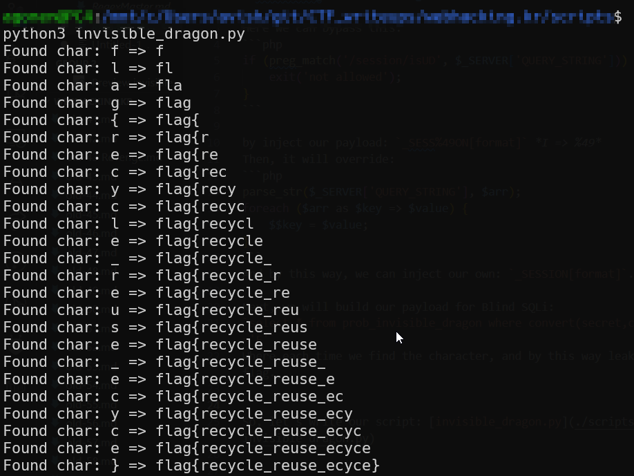

# Webhacking Invisible Dragon Solution

Here we can bypass this:
```php
if (preg_match('/session/isUD', $_SERVER['QUERY_STRING'])) {
    exit('not allowed');
}
```

by inject our payload: `_SESS%49ON[format]` *I => %49*
Then, it will override:
```php
parse_str($_SERVER['QUERY_STRING'], $arr);
foreach ($arr as $key => $value) {
    $$key = $value;
}
```
And by this way, we can inject our own: `_SESSION[format]`.

Next, we will build our payload for Blind SQLi:
`select * from prob_invisible_dragon where convert(secret,char(1))='F'`
Where each time we find the character, and by this way leak the flag.


So, let's write our script: [invisible_dragon.py]
```scripts/invisible_dragon.py

```


**Flag:** ***`FLAG{recycle_reuse_ecyce}`*** 

