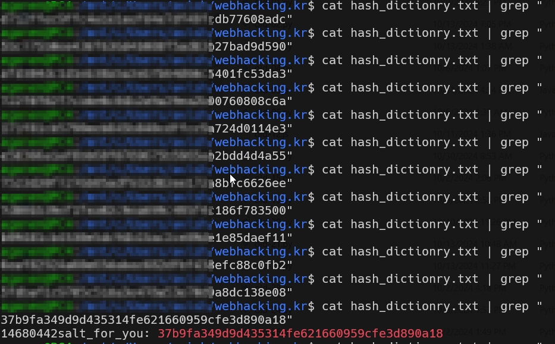

# webhacking old-04 Solution

in this challenge, we do dictionary attack, based on well known salt. we need to calculate as much hashes as possible.

This is the source code: [old-04]
```python
% scripts/old-04.py
```

there is an example of how the dictionary should look like, i gave you only 1000 rows... you need to generate much more rows: [hash-dictionry-old-4]
```
% scripts/hash-dictionry-old-4.txt
```


then, you will refresh the page until there is some hash you can find in the dictionary.
note: as much time you let the script run, more rows you will craft. I believe 30 minutes should be enough.


 
:)