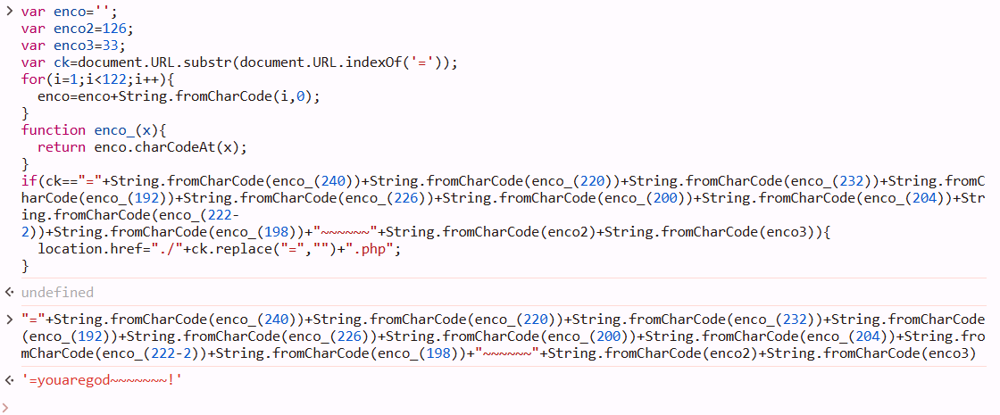

# Webhacking old-12 Solution

first we can see that the js is encoded with aaencode.
let's decode it using websites like https://cat-in-136.github.io/2010/12/aadecode-decode-encoded-as-aaencode.html.

we can paste the js code we got, and see what the if checks:

we got this string `=youaregod~~~~~~~!`
let's go the url:
 `https://webhacking.kr/challenge/code-3/youaregod~~~~~~~!.php`
