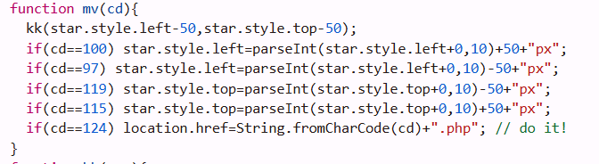

# webhacking.kr old-16 Solution

i can see in the source code this interesting code:

in the last line i see the comment, so i decided to go there:
`https://webhacking.kr/challenge/js-3/|.php`

and if we go there, we managed to pass the challenge
