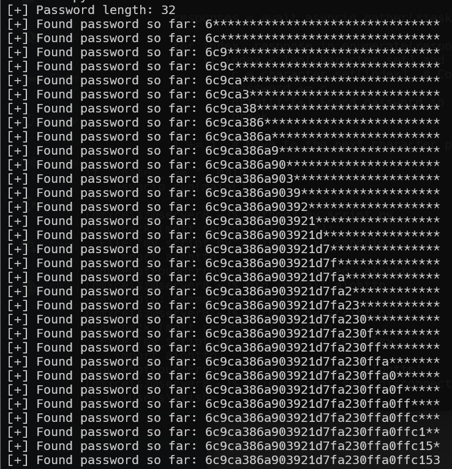

# Webhacking old-22 Solution

Here this is sql injection, when we can extract the `MD5 hash` of the password.
We know that when we assign a user, it appends `apple` as a salt to the end of the password and then MD5 hash it.

source code: [old-22]
```scripts/old-22.py

```


Here you can see the script in action.


Then, we will go to this website [reverse md5](https://md5decrypt.net/en/),
and find out that the reversed hash is `wowapple`, means the password is `wow`

the result will be:
username: `admin`
password: `wow`