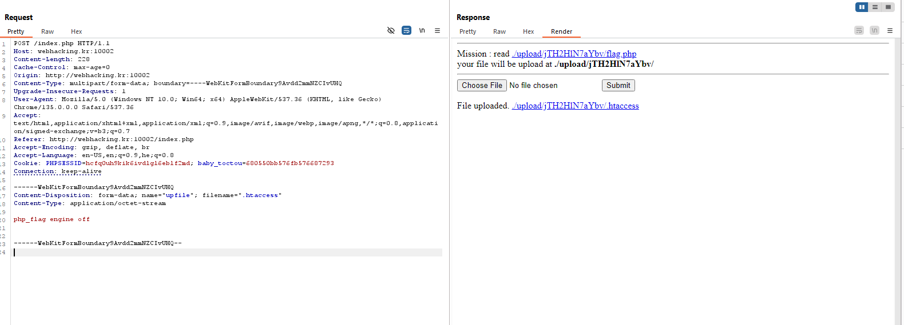

here we can see we can upload files, and when we try to go to `http://webhacking.kr:10002/upload/jTH2HlN7aYbv/flag.php`, we get empty page. That's because there is a php file there, and we can't read the code.

After i tried to access file who isn't exist, i've got an error message that indicate we're using an apache server. Thus, we might control the `.htaccess` file by uploading our file, and writing into it: `php_flag engine off`.

That's what i did, using BurpSuite

After that, we can access the flag and see it, because it isn't executing php anymore.

**Flag:** ***`FLAG{easy_peasy_apachy}`*** 
