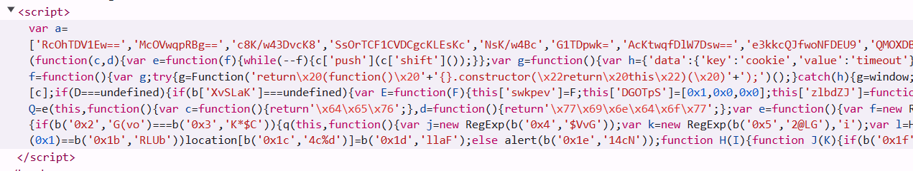
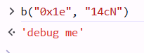

# Webhacking old-34 Solution

as we can see, there is some messy javascript code:



let's try to beautifier it in https://beautifier.io/
and analyze the code
[old-34]
```scripts/old-34.js

```


i saw this if statement:
```
if (location[b("0x19", "iUmC")][b("0x1a", "6]r1")](1) == b("0x1b", "RLUb"))
    location[b("0x1c", "4c%d")] = b("0x1d", "llaF"); 
else 
    alert(b("0x1e", "14cN"));
```

let's try to see what does the alert prints `b("0x1e", "14cN")`



interesting... so, let's try to run the code in the if statement `location[b("0x1c", "4c%d")] = b("0x1d", "llaF");`

this takes us to this url: `https://webhacking.kr/challenge/js-7/?Passw0RRdd=1`
and the is challenge over.