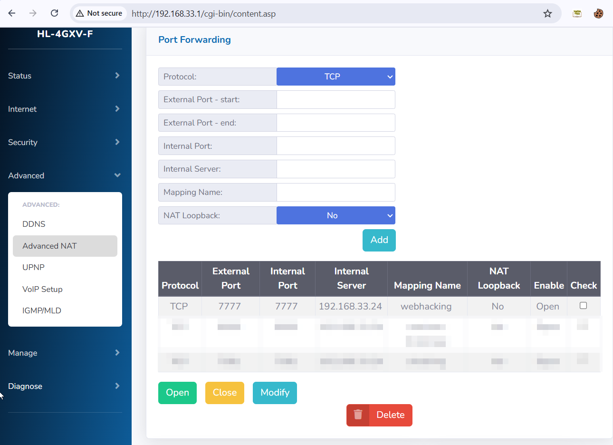
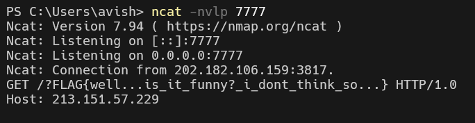

We need to upload a file that called like: `tmp-{time}`, when `{time}` is the current time.
The server opens this file and writes the `REMOTE_ADDR`, which is our ip-address. 
```php
if($file_nm){
    $p = fopen("./tmp/{$file_nm}","w");
    fwrite($p,$_SERVER['REMOTE_ADDR']);
    fclose($p);
  }
```

Then, it takes the content, and send the flag to it, to port `7777`.
```php
    $host = file_get_contents("tmp/tmp-{$time}");

    $request = "GET /?{$flag} HTTP/1.0\r\n";
    $request .= "Host: {$host}\r\n";
    $request .= "\r\n";

    $socket = fsockopen($host,7777,$errstr,$errno,1);
    fputs($socket,$request);
    fclose($socket);
```

We need to set port-forwarding (if needed of course), I set my haleny router:
    

Then, we can use this script, to upload the file.
It didn't manege to work for me, so I simply used burp suite.
```py

```

And of course, set the listener: 
```
ncat -nvlp 7777
```
(in unix systems use nc, same as ncat for powershell)



- Notice, I also needed to add `inbound rule` for the windows firewall

**Flag:** ***`FLAG{well...is_it_funny?_i_dont_think_so...}`*** 
