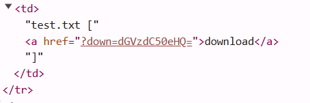

i can see that there is base64 encoding here.

if we will decode this, we will get `test.txt`

so, let's encode the name of the flag file, `flag.docx`
and we will get `ZmxhZy5kb2N4`

let's try do download this:
`https://webhacking.kr/challenge/web-20/?down=ZmxhZy5kb2N4`

**Flag:** ***`FLAG{very_difficult_to_think_up_text_of_the_flag}`*** 

