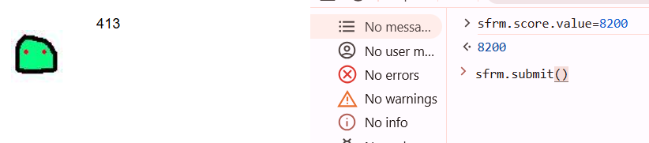

first, i entered the score 8200 using the command line:




then, I tried to find the third column name by using procedure analyse:
`8200 limit 2,1 procedure analyse()`
i got this: `id : webhacking.chall55.p4ssw0rd_1123581321 //`
means the column name is: `p4ssw0rd_1123581321`.

now, we will run the script to find the flag:
[old-55]
```py

```


**Flag:** ***`FLAG{easy_peasy_lemon_squeezy!}`*** 

