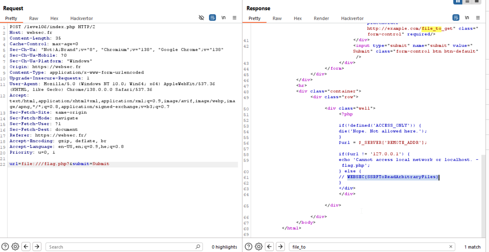

Here you can see the source code, from this check i guess we need to access the `localhost` and retrieve `flag.php`, but not using `localhost`, rather using `127.0.0.1`.
```php
 /* People tends to do funny things with curl. */
if (preg_match ('/[https?|[st]?ftp|dict|gopher|scp|telnet|ldaps?]\:\/\/.*(\d+|[0-9]{1,3}\.[0-9]{1,3}\.[0-9]{1,3}\.[0-9]{1,3})/i', $url)) {
    die('Please do not access by IP.');
} elseif (preg_match ('/localhost/i', $url)) {
    die ('Please do not access localhost.'); 
}
```

Also, we can see here that it appends `index.php` to the url. 
```php
if (stripos ($url, '/', -1) !== '/') { $url .= '/'; }
    $url .= 'index.php';
```
However, we still get *Nope. Not allowed here.*, WHAT IS THAT?

Okay, let's try use `file` schema:
`file:///flag.php?`

YAY :)



We can see what denied us from accessing using `http` to `127.0.0.1`:
```php
if(!defined('ACCESS_ONLY')) {
    die('Nope. Not allowed here.');
}
```
Here you can see how it works [using defined to prevent access - stackoverflow](https://stackoverflow.com/a/409515).

**Flag:** ***`WEBSEC{SSRFToReadArbitraryFiles}`*** 
