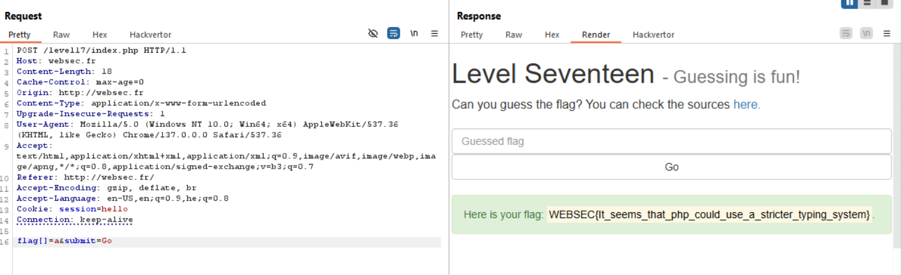

both `strcmp` and `strcasecmp`, when getting array and string, returns null, which the program treats as `true`, look here for explain [stackoverflow](https://stackoverflow.com/questions/62866525/why-strcasecmp-return-true-with-array-and-string).

let's insert this as our data:
`flag[]=a&submit=Go`

**Flag:** ***`WEBSEC{It_seems_that_php_could_use_a_stricter_typing_system}`*** 
