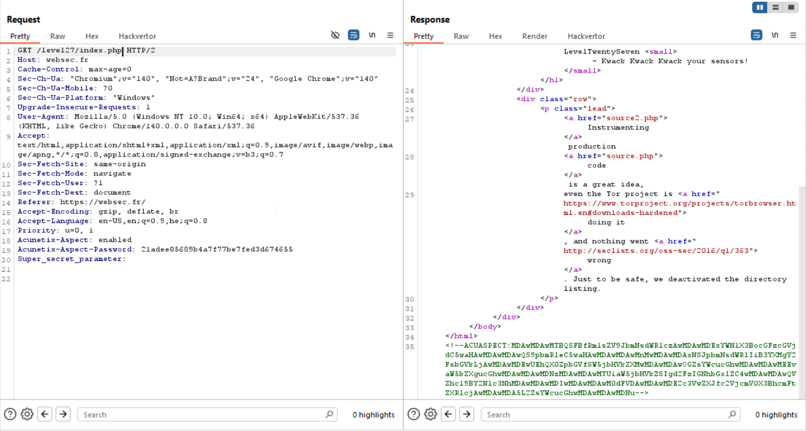
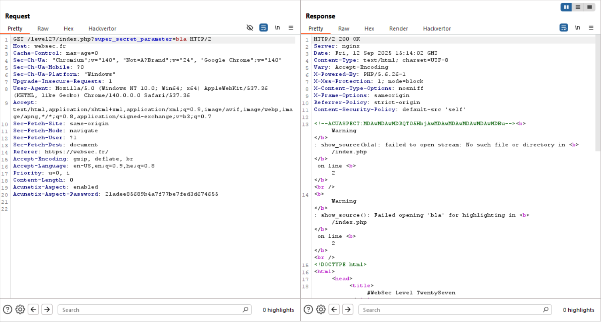

Here we first send the same `GET` query with these headers:
```
Acunetix-Aspect: enabled
Acunetix-Aspect-Password: 21adee85689b4a7f77be7fed3d674655
```
We got the password from `source2.php`.



Then, we get this:
```php
<!--ACUASPECT:MDAwMDAwMTBQSFBfRmlsZV9JbmNsdWRlczAwMDAwMDExYWN1X3BocGFzcGVjdC5waHAwMDAwMDAwQS9pbmRleC5waHAwMDAwMDAwMnMwMDAwMDAxNSJpbmNsdWRlIiB3YXMgY2FsbGVkLjAwMDAwMDEwUEhQX0ZpbGVfSW5jbHVkZXMwMDAwMDAwOGZsYWcucGhwMDAwMDAwMEEvaW5kZXgucGhwMDAwMDAwMDNzMDAwMDAwMTUiaW5jbHVkZSIgd2FzIGNhbGxlZC4wMDAwMDAwQVZhcl9BY2Nlc3NhMDAwMDAwMDIwMDAwMDAwM0dFVDAwMDAwMDE2c3VwZXJfc2VjcmV0X3BhcmFtZXRlcjAwMDAwMDA5L2ZsYWcucGhwMDAwMDAwMDNu-->
```
Which after b64 decoding gives us:
```
00000010    PHP_File_Includes
00000011    acu_phpaspect.php
0000000A    /index.php
00000002    s
00000015    "include" was called.
00000010    PHP_File_Includes
00000008    flag.php
0000000A    /index.php
00000003    s
00000015    "include" was called.
0000000A    
Var_Access  a
00000002
00000003    GET
00000016    super_secret_parameter
00000009    /flag.php
00000003    n
```

Okay, so let's add `super_secret_parameter` and try to get `/flag.php`.

We get back:
```
No RCE allowed.
```

When giving something else, we can see error:
```php
show_source(bla): failed to open stream: No such file or directory in /index.php
```


Okay, so it detects the word `php` and blocks it, and after this filtering, transmit the input we give to `show_source`.

We need to somehow leak the content of `flag.php`, I've tried to use other schemas such as `data://` or `http://`, but they both disabled in this system.
Of course we can't use `php://` URI schema either, because it contains the word `php`.

.... To be continue :)

**Flag:** ***`PLACE_HOLDER`*** 
