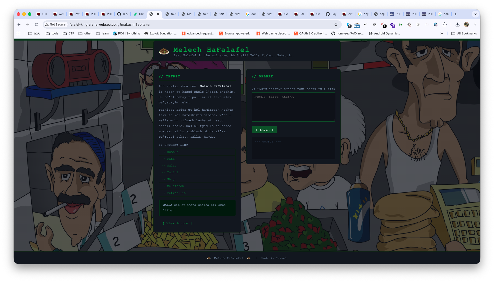
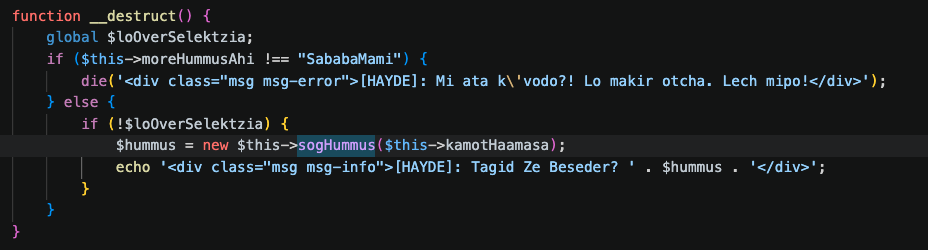

In this challenge we first got this note:

> IMPORTANT NOTE: PHP version is 7.1. The flag is located in a file above web root.

And this is the challenge itself:



It has a lot of code, we'll need to bypass several stages until we reach the flag:

```php
$loOverSelektzia = true;

function amba(string $s): string { return base64_decode(str_rot13($s)); }

class Salat {
    public $balagan="hayde balaganim";
    public $tachles;

    function __wakeup() {
        echo '<div class="msg msg-info">[SALAT]: Kama dvarim yesh po... ' . $this->balagan . '</div>';
    }

    function __toString() {
        echo '<div class="msg msg-info">[SALAT]: ' . $this->tachles . '</div>';
        return "salat";
    }
}

class Tahini {
    public $kapit="kolla falafel ahi, mi tzraih kapit??";
    public $shilov="shilov katlani";
    public $hummus;

    function __destruct() {
        echo '<div class="msg msg-info">[TAHINI]: Chafif, ' . $this->shilov . '...</div>';
        $this->kapit->timrach();
    }

    function __toString() {
        return "tahini | " . $this->shilov;
    }
}

class Hummus {
    public $moreHummusAhi;
    public $sogHummus = "ah sheli lama lo original?? who eats tzabar anyway";
    public $kamotHaamasa = 20;

    function __construct($moreHummusAhi) {
        if ($moreHummusAhi === "SababaMami") {
            die('<div class="msg msg-error">[HAYDE]: Lo overdim kacha po! Tafasta oti? Yalla bye!</div>');
        } else {
            $this->moreHummusAhi = $moreHummusAhi;
        }
    }

    function __toString() {
        return $this->moreHummusAhi;
    }

    function __destruct() {
        global $loOverSelektzia;
        if ($this->moreHummusAhi !== "SababaMami") {
            die('<div class="msg msg-error">[HAYDE]: Mi ata k\'vodo?! Lo makir otcha. Lech mipo!</div>');
        } else {
            if (!$loOverSelektzia) {
                $hummus = new $this->sogHummus($this->kamotHaamasa);
                echo '<div class="msg msg-info">[HAYDE]: Tagid Ze Beseder? ' . $hummus . '</div>';
            }
        }
    }
}

class Pita {
    public $maLasimBePita;

    function __wakeup() {
        echo '<div class="msg msg-info">[PITA]: ' . $this->maLasimBePita . '</div>';
    }

    function __toString() {
        return (new Hummus($this->maLasimBePita))->moreHummusAhi;
    }
}

class Shug {
    public $hourHabibi="ma hasaah?";
    public $mispar="walla lo yodea";

    function __call($name, $args) {
        echo '<div class="msg msg-info">[SHUG]: Charif! Calling ' . $name . ' be\'lo reshut...</div>';
        if (md5(md5($this->hourHabibi)) == 1337) {
            return ($this->mispar)();
        } else {
            return $this->mispar->{"lo mitkasher, kishta!"};
        }
    }
}

class Melafefon {
    public $yalla;

    function __invoke() {
        global $loOverSelektzia;
        echo '<div class="msg msg-info">[MELAFEFON]: Lo tzafiti oto po...</div>';
        $loOverSelektzia = false;
        $info = "[MELECH KITCHEN] " . $this->yalla;
        echo '<div class="msg msg-info">' . htmlspecialchars($info) . '</div>';
    }

    function __get($name) {
        echo '<div class="msg msg-info">[MELAFEFON]: Nigshu le-' . $name . '!</div>';
        $this->yalla->$name = "melafefon";
    }
}

class Petrozilia {
    private $out="yalla ten petrozilia ahi";
    private $hallasKvar="taamis taamis";
    public $balagan1;  public $balagan2;  public $balagan3;  public $balagan4;
    public $balagan5;  public $balagan6;  public $balagan7;  public $balagan8;
    public $balagan9;  public $balagan10; public $balagan11; public $balagan12;
    public $balagan13; public $balagan14; public $balagan15; public $balagan16;
    public $balagan17; public $balagan18; public $balagan19; public $balagan20;

    function __toString() {
        echo '<div class="msg msg-info">[PETROZILIA]: Achi, tisma — tikanes oti, ani kavua kan. Tavi li manah melea shel hamelech.</div>';
        return "petrozilia";
    }

    function __set($name, $value) {
        echo '<div class="msg msg-info">[PETROZILIA]: Lo gozlim mi-kavua!</div>';
    }

    function __destruct() {
        $this->hallasKvar = "Dai, Nimas!";
    }
}

if (isset($_GET['show_source'])) {
    highlight_file(__FILE__);
    die();
}

$raw_input = null;
if (!empty($_GET["maLasimBepita"])) {
    $raw_input = amba($_GET["maLasimBepita"]);
}

```

Let's start :)

It do the `unserialize` on the `raw_input`, which is the input after it goes through the function `amba`:

```php
function amba(string $s): string { return base64_decode(str_rot13($s)); }
```

So, we'll need to rot13 the string and then encode it, before sending every payload we want. I'll use the extension *Hackvertor* in BurpSuite.

We can see here the sink `$this->sogHummus($this->kamotHaamasa)`.

