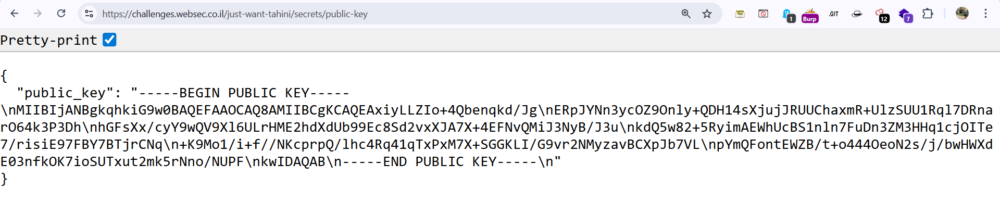
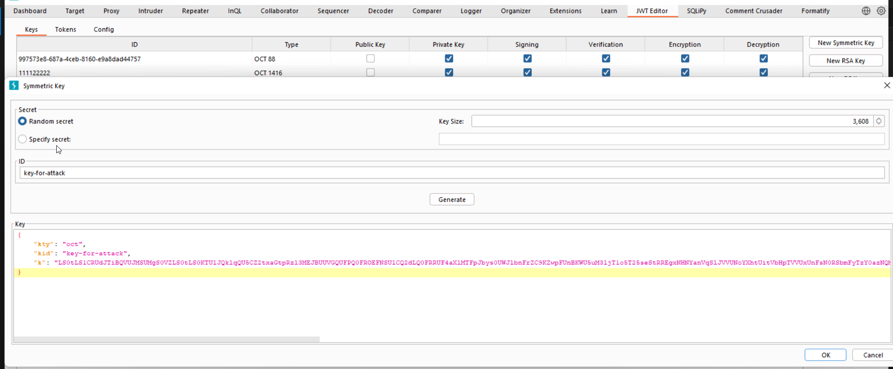
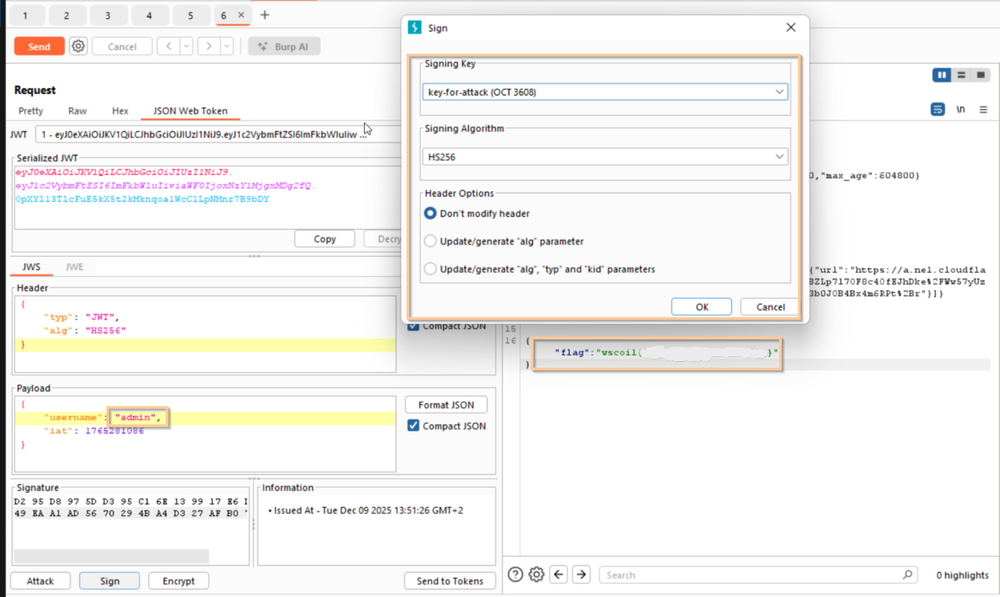

After login, we can see this welcome portal:


Inside the source-code, we can find these comments:
```bash
<!-- Check out these source files!!! : -->
      <!-- source1.js -->
      <!-- source2.js -->
      <!-- source3.js -->
```


So, I checked and realize the flag is at `/secrets/flag`. However, we must have working `JWT token` of `admin` user.

In addition, the public key is located at `/secrets/public-key`. I realized this is vulnerable for HMAC confusion attack, like shown here [https://avishaigonen123.github.io/CTF_writeups/root-me/Web-Server/JWT-Public-key.html](https://avishaigonen123.github.io/CTF_writeups/root-me/Web-Server/JWT-Public-key.html).

So, I took the public-key:


After modification, we get this public-key:
```bash
-----BEGIN PUBLIC KEY-----
MIIBIjANBgkqhkiG9w0BAQEFAAOCAQ8AMIIBCgKCAQEAxiyLLZIo+4Qbenqkd/Jg
ERpJYNn3ycOZ9Only+QDH14sXjujJRUUChaxmR+UlzSUU1Rql7DRnarO64k3P3Dh
hGFsXx/cyY9wQV9Xl6ULrHME2hdXdUb99Ec8Sd2vxXJA7X+4EFNvQMiJ3NyB/J3u
kdQ5w82+5RyimAEWhUcBS1nln7FuDn3ZM3HHq1cjOITe7/risiE97FBY7BTjrCNq
+K9Mo1/i+f//NKcprpQ/lhc4Rq41qTxPxM7X+SGGKLI/G9vr2NMyzavBCXpJb7VL
pYmQFontEWZB/t+o444OeoN2s/j/bwHWXdE03nfkOK7ioSUTxut2mk5rNno/NUPF
kwIDAQAB
-----END PUBLIC KEY-----
```

Now, base64 encode it:
```bash
┌──(me㉿PC4)-[~/websec.il/just-want-tahini]
└─$ openssl ec -pubin -in out.pem | base64 -w 0
read EC key
writing EC key
LS0tLS1CRUdJTiBQVUJMSUMgS0VZLS0tLS0KTUlJQklqQU5CZ2txaGtpRzl3MEJBUUVGQUFPQ0FROEFNSUlCQ2dLQ0FRRUF4aXlMTFpJbys0UWJlbnFrZC9KZwpFUnBKWU5uM3ljT1o5T25seStRREgxNHNYanVqSlJVVUNoYXhtUitVbHpTVVUxUnFsN0RSbmFyTzY0azNQM0RoCmhHRnNYeC9jeVk5d1FWOVhsNlVMckhNRTJoZFhkVWI5OUVjOFNkMnZ4WEpBN1grNEVGTnZRTWlKM055Qi9KM3UKa2RRNXc4Mis1UnlpbUFFV2hVY0JTMW5sbjdGdURuM1pNM0hIcTFjak9JVGU3L3Jpc2lFOTdGQlk3QlRqckNOcQorSzlNbzEvaStmLy9OS2NwcnBRL2xoYzRScTQxcVR4UHhNN1grU0dHS0xJL0c5dnIyTk15emF2QkNYcEpiN1ZMCnBZbVFGb250RVdaQi90K280NDRPZW9OMnMvai9id0hXWGRFMDNuZmtPSzdpb1NVVHh1dDJtazVyTm5vL05VUEYKa3dJREFRQUIKLS0tLS1FTkQgUFVCTElDIEtFWS0tLS0tCg==
```

And create new symmetric key in the tab of `JWT Editor`, extension for Burp



Now, let's change the username to `admin` and sign the payload with our new key:



And this is the flag we achieved
```bash
wscoil{----------------}
```