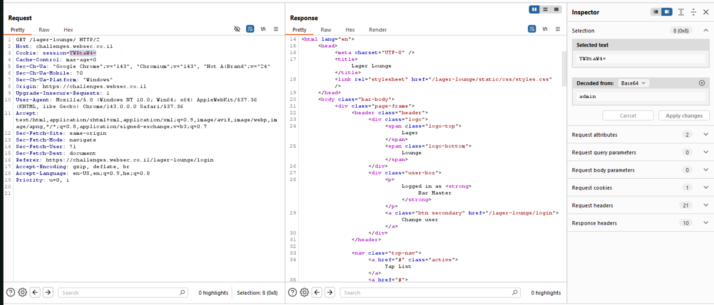
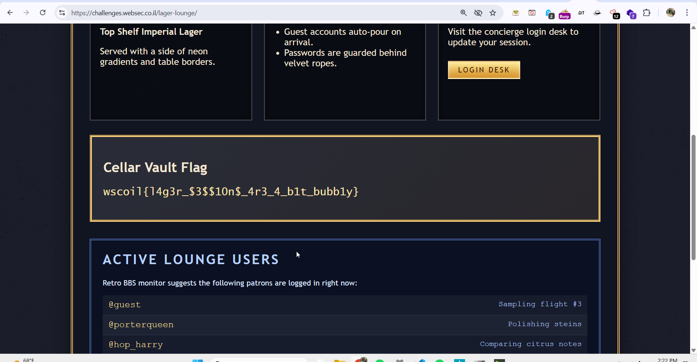

In this challenge I noticed that when we logged in as guest with the credentials:
```bash
guest:guestpass
```

There was session cookie that was set to
```bash
Cookie: session=Z3Vlc3Q=
```

Which after decoding gave me `guest`.

So, I simply encoded `admin` and sent the cookie:
```bash
Cookie: session=YWRtaW4=
```



we logged in as admin and got the flag:



```bash
wscoil{--------------------}
```
