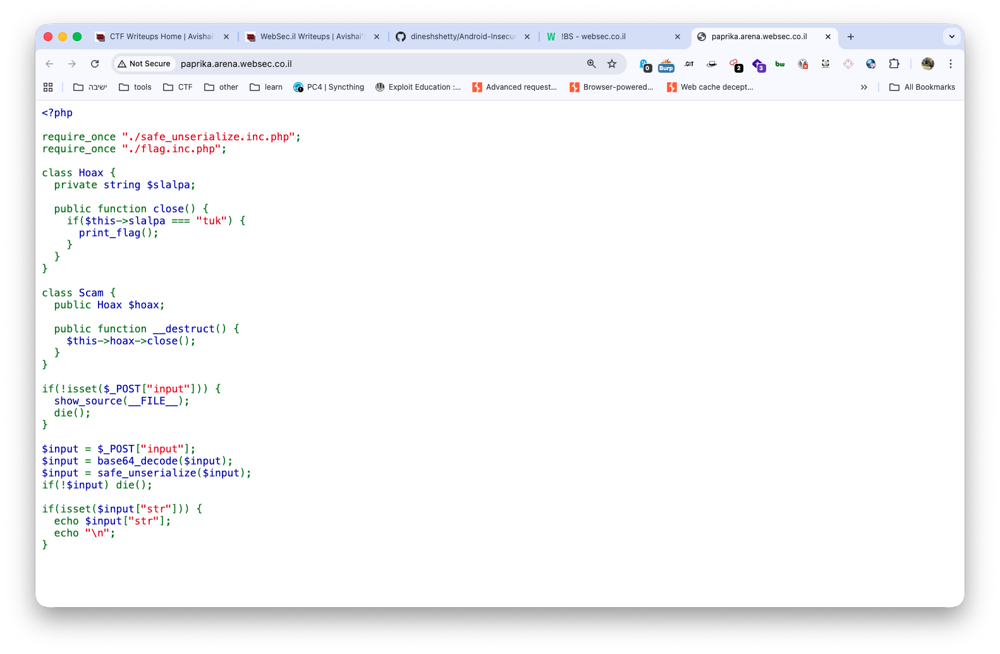
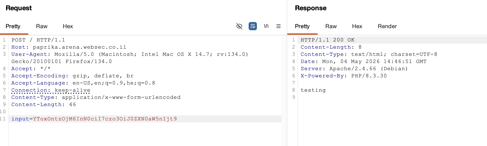

First, we can see this is the source code:

```php
<?php

require_once "./safe_unserialize.inc.php";
require_once "./flag.inc.php";

class Hoax {
  private string $slalpa;

  public function close() {
    if($this->slalpa === "tuk") {
      print_flag();
    }
  }
}

class Scam {
  public Hoax $hoax;

  public function __destruct() {
    $this->hoax->close();
  }
}

if(!isset($_POST["input"])) {
  show_source(__FILE__);
  die();
}

$input = $_POST["input"];
$input = base64_decode($input);
$input = safe_unserialize($input);
if(!$input) die();

if(isset($input["str"])) {
  echo $input["str"];
  echo "\n";
}
```


It looks like some classic unserialize challenge, where we need to get object instantiation, similar to [https://avishaigonen123.github.io/CTF_writeups/root-me/Web-Server/PHP-Unserialize-Pop-Chain.html](https://avishaigonen123.github.io/CTF_writeups/root-me/Web-Server/PHP-Unserialize-Pop-Chain.html) .

We need to create the object `Scam`, with the public field `hoax` that holds the class `Hoax` with the private field `slapla` with the value `tuk`.

On first glance, it needs to be very easy, using snippet like this:

```php
<?php

class Hoax {
    private string $slalpa = "tuk";
}

class Scam {
    public Hoax $hoax;

    public function __construct() {
        $this->hoax = new Hoax();
    }
}

$input = new Scam();
$serialized = serialize($input);
$encoded = base64_encode($serialized);

echo $encoded;
```

However, this is much complicated because it uses `safe_unserialize`, which sanitises input, blocks us from object instantiation.

Notice we have the ability to check what works, using the `$input["str"]`, which it prints. 
For example, given this snippet:

```php
$input = ["str" => "testing"];
$serialized = serialize($input);
$encoded = base64_encode($serialized);
```



Anyway, I tried different methods to bypass the sanitisation, maybe using something like shown here [https://avishaigonen123.github.io/CTF_writeups/websec.fr/level20.html](https://avishaigonen123.github.io/CTF_writeups/websec.fr/level20.html). 

Nothing works yet, although it looks like it makes something in the example brought in the link.